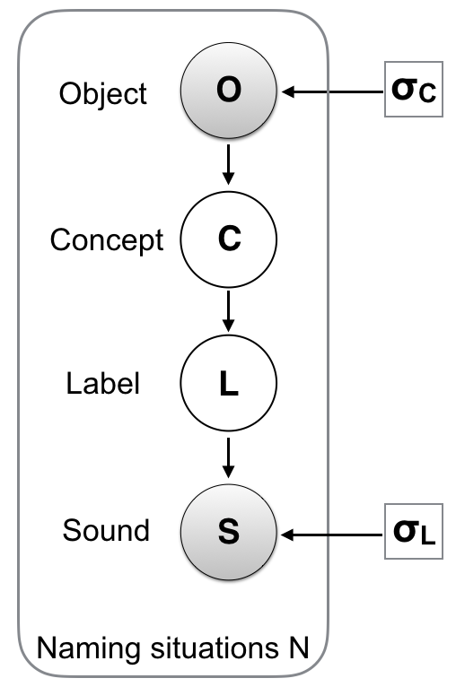

```{r}
knitr::opts_chunk$set(echo=F, warning=F, cache=F, message=F, sanitize = T)
```


```{r load_packages, include = FALSE}
library(papaja)
library(png)
library(grid)
library(ggplot2)
library(ggthemes)
library(xtable)
options(xtable.comment = FALSE)
library(purrr)
library(readr)
library(ggplot2)
library(langcog)
library(boot)
#library(lazyeval)
library(dplyr)
library(tidyr)
library(wordbankr)
library(directlabels)
#library(scales)
library(stringr)
library(lmtest)
library(rwebppl)
library(jsonlite)
library(nlme)
library(feather)
library(broom)
library(HDInterval)
library(BBmisc)
library(stargazer)
library(lme4)
library(kableExtra)
```

#Introduction

Cognitive development is sometimes characterized in terms of a succession of discontinuous stages [@piaget1954]. Although intuitively appealing, stage theories can be challenging to integrate with theories of learning, which typically posit that knowledge and skills improve incrementally with experience. Indeed, one of the central challenges of cognitive development has been to explain transitions between stages which appear to be qualitatively different [@carey2009].

Nevertheless, at least in some cases, development may only appear to be stage-like. This appearance can be due, for example, to the use of a cognitively-demanding task which may mask learning, or to the use of statistical thresholding (in particular, p-value < 0.05) which can create a spurious dichotomy between success and failure in observing a given behavior. In such cases, positing discontinuous stages is unnecessary. Instead, a continuous model---involving similar representations across the lifespan---may provide a simpler and more transparent account of development.

We use a case study from word learning literature. @stager1997 first showed that children's early ability to distinguish similar sounds does not automatically translate into word learning skills. The authors measured word learning using an audio-visual habituation Switch task. First, infants are familiarized with two word-object pairings (e.g., lable A with object A and label B with object B). Second, they are tested using two types of trials. The control 'same' trial consists of a correct pairing  (e.g., label A with object A) and the 'switch' trial consists of a wrong pairing (e.g., label A with object B). If babies have correctly learned the association during the familiarization, they are supposed to be surprised by the 'switch' trial and not by the 'same' trial. The former should thus result in a greater looking time compared to the latter [@werker1998].

Though infants around 14-month old can distinguish perceptually similar sound pairs such as "dih" and "bih", they appear to fail in mapping this pair to two different objects in the switch task. This failure has initially been taken as evidence that 14-month olds do not encode subtle sounds during meaning learning [@stager1997; @pater2004]. This interpretation suggested a discontinuous/stage-like pattern of development whereby younger children fail to encode the contrastive phonetic detail, whereas older children, around 17 months, typically do [@werker2002].

<!-- In fact, @stager1997 noted that "Infants of 14 months fail to detect the same phonetic detail that they can easily detect in a simple syllable discrimination task". They argued that the high cogntive demands of the task make children experience a limitation in the amount of phonetic details they can access. In a similar vein, Pater et al. (2004) argued that "when a contrast is first acquired, it is not stable and can be lost under processing demands"-->


<!--Follow-up studies has focused mainly on proposing possible explanations for the observed gap between speech perception and word learning [e.g., @fennell2010; @stager1997; @hofer2017; @rost2009]. -->

The initial discontinuous interpretation has been challenged by subsequent work. For instance, @yoshida2009 investigated whether failure in the switch task reflects a lack of sound encoding during *familiarization*, or whether it is only due to the demands of the *testing* method which does not allow learning below a certain threshold to be detected. They used the same familiarization procedure as @stager1997, but instead of comparing the looking times in 'same' and 'switch' trials, they tested infants using a two-alternative choice task comparing fixations to target and distractor objects [@golinkoff1987; @fernald2006]. Using this simpler and finer-grained task, the researcher found evidence for learning even in 14-month olds.

Another challenge to the discontinuous account of development came from adult studies. If the mismatch between sound discrimination and word learning is only a stage in early infancy, then this mismatch should disappear by adulthood. Nonetheless, even adults show patterns of learning that mirror those shown by 14-month-olds when the sound contrasts more challenging [@white2013; @pajak2016].

Some researchers [@swingley2007; @yoshida2009; @pajak2016] proposed that the phonological form may not be encoded in a binary fashion, i.e., it is not the case that children either succeed or fail in encoding minimal contrast when learning the meanings. Rather, they may be encoding the phonological form of words in a probabilistic fashion. According to this view, development does not so much involve a qualitative shift (i.e., a sudden emergence of an ability that did not exist before) as much as it consists in the continuous refinement of initially noisy representations. 

In a probabilistic account, a word can be represented as a probability distribution over sound instances organized in a similarity space. The probability is highest at the most typical sound instance. It decreases as the instance becomes less typical. The precision of the representation can be characterized by how much it tolerates slightly atypical pronunciations. This tolerance is captured formally by the variance of the probability distribution: larger variance indicates higher tolerance and lower precision, whereas smaller variance indicates lower tolerance and higher precision. 

This framework can explain several findings. In Stager and Werker's original experiment, children are supposed to associate one label "bih" with object 1 and a second label "dih" with object 2.  Though infants could learn that the label "bih" is a better match to object 1 than "dih", they could still judge the sound "dih" as a plausible instance of the label "bih", thanks to the relatively large variance of the early encoding, and this confusion leads to "failure" in the recognition task (Figure \@ref(fig:illus), top). Though learning is small and is easily disrupted by the Switch task, it can still be detected when less demanding methods are used [@yoshida2009]. 

The learning accuracy increases (and is detected even by demanding tests such as the Switch) for more distinct word-forms (e.g., "lif" vs. "neem") where the perceptual distance is large relative to the variance (Figure \@ref(fig:illus), left).  Distinctiveness can be enhanced even for minimally different sounds when other cues highlight their difference [@rost2009; @rost2010; @thiessen2007; @yeung09; @dautriche2015]. 

Finally, development can be understood as an increase in the precision (i.e., a decrease in the variance) of the probabilistic representations (Figure \@ref(fig:illus), right). Such an increase in precision renders minimally different sounds less confusing. Importantly, a more precise representation still has a non-zero variance --- Learning difficulties can still be induced with challenging stimuli or in cognitively demanding situations as was demonstrate in adults studies [@white2013; @pajak2016]. 

## This study

The probabilistic account has been put forward to explain patterns of learning and development at the qualitative level. However, it is crucial to have a precise computational instantiation of this account which would allow us to *quantify* its explanatory power. We could find one previous work that attempted to provide such a computational instantiation  (Hofer and Levy, 2017). However, this previous work was designed with the goal of reproducing the results of a specific study [@pajak2016] which focused on explaining the mismatch between speech perception and word learning in adults rather than on exploring the mechanism of development.

The present work proposes a model of word-pair learning based on the probabilistic account. We tested the ability of this model to both *explain* various findings in previous experiments in both children and adults (e.g., the fact that similar words are harder to learn than different words) and to *predict* new learning patterns that have not been tested before (i.e., the effect of the referents' similarity on word learning). Crucially, we explored the extent to which development can be understood as a continuous refinement in similar representations across the lifespan.

The paper is organized as follows. First, we introduce the model and we explain how it allows us to characterize behavior in a word learning task which resembles the one used in @stager1997 and @yoshida2009. Then we explore the predictions of the model through simulating its behavior across different parameter settings. Next we quantify the extent to which the model's predictions account for human data we collected from both preschool children and adults. Finally, we discuss the results in the lights of existing accounts of word development. 


```{r illus, fig.cap = "An illustration of the probabilistic/continuous account using simulated data. A word is represented with a distribution over the perceptual space (indicated in red or blue). When the uncertainty of the representation is large relative to the distance between the stimuli (top panel), an instance of the red category (indicated with a star) could also be a plausible instance of the green category, hence the low recognition accuracy score. The accuracy increases when the stimuli are less similar (left panel), or when the representation are more precise (right panel).", fig.align = "center", out.width = "300px"}
knitr::include_graphics("figs/illustration.png")
```

# Model 

<!--In previous studies, only the similarity of the sounds was varied across conditions (e.g., "bin"/"din" vs. "lif"/"neem"). In our task, we also vary the visual similarity of the objects, which allows us to explore the effect of additional probabilistic cues on novel word learning and recognition. An overview of the task is presented in Figure XX. -->

## Probabilistic structure

Our model consists of a set of variables describing the general process of spoken word recognition in a referential situation. These variables are related in a way that reflects the simple generative scenario represented graphically in Figure \@ref(fig:model). When a speaker utters a sound in the presence of an object, the observer assumes that the object $o$ activated the concept $C$ in the speaker's mind. The concept prompted the corresponding label $L$. Finally, the label was physically instantiated by the sound $s$. 

```{r model, fig.cap = "Graphical representation of our model. Circles indicate random variables (shading indicates observed variables). The squares indicate fixed model parameters.", fig.align = "center", out.width = "300px"}

```


A similar probabilistic structure was used by @lewis2013 to model concept learning, and by @hofer2017 to model spoken word learning. However, the first study assumed that the sounds are heard unambiguously, and the second assumed the concepts are observed unambiguously. In our model, we assume that both labels and concepts are observed with a certain amount of perceptual noise, which we assume, for simplicity, is captured by a normal distribution:

$$ p(o | C) \sim  \mathcal{N}(\mu_C, \sigma^2_C) $$

$$ p(s| L) \sim  \mathcal{N}(\mu_L, \sigma^2_L) $$

Finally, we assume there to be one-to-one mappings between concepts and labels and that observers have successfully learned these mappings during the exposure phase:
$$
P(L_i|C_j) = 
\begin{cases}
  1 & \text{if  }  i=j \\  
  0  & \text{otherwise  }
\end{cases}
$$

## Inference

The learner hears a sound $s$ and has to decide which object $o$ provides an optimal match to this sound (see Figure \@ref(fig:task)). To this end, they must compute the probability $P(o|s)$ for all possible objects. This probability can be computed by summing over all possible concepts and labels:
$$P(o|s)=\sum_{C,L} P(o, C, L| s) \propto \sum_{C,L} P(o, C, L, s) $$

The joint probability $P(o, C, L, s)$ is obtained by factoring the Bayesian network in Figure \@ref(fig:model):
$$P(o,C,L,s) = P(s|L)P(L|C)P(C|o)P(o) $$

which can be transformed using Bayes rule into:

$$P(o,C,L,s) = P(s|L)P(L|C)P(o|C)P(C) $$

Finally, assuming that the concepts' prior probability is uniformly distributed\footnote{This is a reasonable assumption in our particular case given the similarity of the concepts used in each naming situation in our experiment.}, we obtain the following expression, where all conditional dependencies are now well defined:

$$
P(o|s) = \frac{\sum_{C,L} P(s|L)P(o|C)P(L|C)}{\sum_{o} \sum_{C,L} P(s|L)P(o|C)P(L|C)}
$$


## Task and model predictions 

```{r task, fig.env = "figure", fig.pos = "t", fig.align='center', fig.width=4, fig.height=3, fig.cap = "An overview of the task used in this study."}

knitr::include_graphics("figs/task.png")

```

We use the model to predict word learning in a task similar to the one introduced by @stager1997. We used a modified version of the task where the testing method consists in a two-alternative forced choice [@yoshida2009]. In this task, participants are first exposed to the association between pairs of nonsense words (e.g., "lif"/"neem") and pairs of objects. The word-object associations are introduced sequentially. After this exposure phase, participants perform a series of test trials. In each of these trials, one of the two sounds is uttered (e.g., “lif”) and participants choose the corresponding object from the two alternatives. An overview of the task is shown in Figure \@ref(fig:task).

From the general expression (1), we derive three exact analytical solutions instantiating different learning assumptions. The first solution is derived by assuming that the labels are recovered from sounds with a certain level of uncertainty $\sigma_L$, but that concepts are unambiguously recovered from the observed objects, i.e., $\sigma_C \rightarrow 0$. This assumption has been made --- whether implicitly or explicitly --- by most previous work in this line of research. One important implication of this assumption is that only the similarity of word sounds modulates success in word learning, not the similarity of the referents (as long as these referents are differentiated perceptually). This assumption yields the following probability function:

\begin{equation}
P(o_T|s)= \frac{1}{1 + e^{-\frac{\Delta s^2}{2\sigma_L^2}}}
\end{equation}

The second solution is derived by making the more general assumption that both the labels and the concepts are recovered with ambiguity from the sounds and objects. We first introduce the simplifying assumption that the label-related uncertainty $\sigma_L$ and the concept-related uncertainty $\sigma_C$ are of a similar magnitude, i.e., $\sigma_C \approx \sigma_L = \sigma$. This assumption makes the prediction that the sound similarity and the object similarity impact word learning accuracy in exactly the same way. Furthermore, it allows us to study the behavior of the model with minimal free parameters. 


\begin{equation}
P(o_T|s)= \frac{1 + e^{- \frac{\Delta s^2 + \Delta o^2}{2\sigma^2}}}{1 + e^{-\frac{\Delta s^2 + \Delta o^2}{2\sigma^2}}+ e^{-\frac{\Delta s^2}{2\sigma^2}} + e^{-\frac{\Delta o^2}{2\sigma^2}}}
\end{equation}

We finally derive the third (and most general) solution which allows label- and concept-related uncertainties to vary independently. 

\begin{equation}
P(o_T|s)= \frac{1 + e^{- (\frac{\Delta s^2}{2\sigma_L^2}+ \frac{\Delta o^2}{2\sigma_C^2})}}{1 + e^{-(\frac{\Delta s^2}{2\sigma_L^2}+ \frac{\Delta o^2}{2\sigma_C^2})}+ e^{-\frac{\Delta s^2}{2\sigma_L^2}} + e^{-\frac{\Delta o^2}{2\sigma_C^2}}}
\end{equation}

In order to understand the predictions of the models (especially the more general ones, i.e., Model 2 and 3), Figure \ref{fig:simulation} show some simulations of the accuracy $P(o_T|s)$ as a function of the distinctiveness parameters ($\Delta s$ and $\Delta o$) and the uncertainty parameters $\sigma_L$ and $\sigma_C$.  


```{r, echo=FALSE}
pdf.options(encoding='CP1250')
```

```{r }

#Import data from saved
simulations <- feather::read_feather("../saved_data/simulations.feather") %>%
  mutate(obj = ifelse(object_distance == "0.25", "\u0394o = 0.25",
                      ifelse(object_distance == "0.5","\u0394o = 0.5",
                             "\u0394o = 1")))


plot_simulation <- ggplot(simulations, aes(x=x, y=y, col=sigma)) + 
  geom_line() + 
  theme_few()+
  theme(legend.title = element_text(size=11),
      legend.text=element_text(size=11),
      axis.text = element_text(size = 8),
      aspect.ratio = 0.7
      )+
  #plot.margin=grid::unit(c(0,0,0,0), "mm")
  ylim(c(0.4,1))+
  geom_hline(yintercept = 0.50, linetype="dashed") +
  xlab(expression(Delta*"s")) + ylab(expression("P("*o['T']*"| s)")) +
  facet_grid(.~obj) +
  #facet_grid(.~object_distance) +
  scale_color_discrete(name = expression(sigma))
  
```

```{r simulation, fig.cap = "The predicted probability of accurate responses in the testing phase as a function of stimuli distinctiveness $\\Delta s$ and $\\Delta o$ and representation precision $\\sigma$ (For clarity, we assume here that $\\sigma$=$\\sigma_C$=$\\sigma_L$). Dashed line represents chance."}
plot_simulation

```

The simulations explain two experimental results from previous studies and make one new prediction:

1) For fixed values of $\Delta o$ and  $\sigma$, the probability of accurate responses increases as a function of $\Delta s$. This pattern accounts for the fact that similar sounds are generally more challenging to learn than different sounds for both children [@stager1997] and adults [@pajak2016]. 

2) For fixed values of $\Delta s$ and $\Delta o$, accuracy increases when the representational uncertainty $\sigma$ decreases. This fact may explain development, i.e., younger children have noisier representations [see @swingley2007; @yoshida2009], which leads to lower word recognition accuracy, especially for similar-sounding words.

3) For fixed values of $\Delta s$ and $\sigma$, accuracy increases with the visual distance between the semantic referents $\Delta o$. This is a new prediction that our model makes. Previous work studied the effect of several bottom-up and top-down properties in disambiguating similar sounding words [e.g., @fennell2010; @rost2009; @thiessen2007], but to our knowledge, no previous study in the literature tested the effect of the visual distance between the semantic referents.

# Experiment

In this experiment, we tested participants in the word learning task introduced above (Figure \@ref(fig:task)). More precisely, we explored the predictions related to both distinctiveness and precision. Sound similarity ($\Delta s$) and object similarity ($\Delta o$) were varied simultaneously in a within-subject design. Two age groups (preschool children and adults) were tested on the same task to explore whether development can be characterized with the uncertainty parameters, $\sigma_C$ and $\sigma_L$. The experiment, sample size, exclusion criteria and the model's main predictions were pre-registered.\footnote{https://osf.io/942gv/}

```{r}
#Sample size

#Children:

d_child <- read_delim("../Analysis/kids_all_final.txt", delim = " ") %>%
  filter(type == "Test") %>%
  filter(age != 6) %>%
  filter(code != 'test',
         !is.na(code)) %>%
  filter(grepl('soph', code)) %>%
  mutate(iscorrect=ifelse(answer==correct, 1, 0))

d_child_score <- d_child %>%
  group_by(ID, sound_dist, concept_dist) %>%
  dplyr::summarise(mean = mean(iscorrect))

#Catch
d_child_excl <- d_child_score %>%
  filter(sound_dist == 'catch') %>%
  ungroup() %>%
  select(ID, mean) %>%
  dplyr::rename(score = mean)

d_child_good <- d_child %>%
  left_join(d_child_excl) %>%
  filter(score > 0.5) %>%
  filter(sound_dist != 'catch')

N_all_ch <- d_child %>% distinct(ID) %>% nrow()
N_good_ch <- d_child_good %>% distinct(ID) %>% nrow()


#Adults

d_adult <- read_delim("../Analysis/adults_100.txt", delim = " ")  %>%
  filter(type == "Test") %>%
  mutate(iscorrect=ifelse(answer==correct, 1, 0)) 

d_adult_lang <- d_adult %>% #Here I will  filter out particiapants whose first language is arabic or hindi
  filter(other == "yes") %>% distinct(ID) %>% nrow()

d_adult_score <- d_adult %>%
  group_by(ID, sound_dist, concept_dist) %>%
  dplyr::summarise(mean = mean(iscorrect))

d_adult_excl <- d_adult_score %>%
  filter(sound_dist == 'catch') %>%
  ungroup() %>%
  select(ID, mean) %>%
  dplyr::rename(score = mean)
  #select(ID, score)
  
d_adult_good <- d_adult %>%
  left_join(d_adult_excl) %>%
  filter(other != "yes") %>%
  filter(score >0.7) %>%
  filter(sound_dist != 'catch')

N_all_ad <- d_adult %>% distinct(ID) %>% nrow()
N_good_ad <- d_adult_good %>% distinct(ID) %>% nrow()

```

## Methods

### Participants
We report data from $N=$ `r N_good_ch` children ages 4-5 years from the Bing Nursery School on Stanford University’s campus. An additional $N=$ `r N_all_ch-N_good_ch` children participated but were removed from analyses because they were not above chance on the catch trials due to the challenging nature of our procedure (see below). We also report data from $N=$ `r N_good_ad` adult participants tested on Amazon Mechanical Turk. An additional $N=$ `r N_all_ad-N_good_ad` were tested but removed from analyses because they had low scores on the catch trials or because they were familiar with the non-English sound stimuli we used in the adult experiment.

### Stimuli and similarity rating
The sound stimuli were generated using the MBROLA Speech Synthesizer [@dutoit1996]. We generated three kinds of nonsense word pairs which varied in their degree of perceptual similarity to English speakers: 1) *different* pairs: "lif"/"neem" and "zem"/"doof", 2) *intermediate* pairs: "aka"/"ama" and "ada"/"aba", and 3) *similar* non-English pairs: "ada"/"a\textipa{d\super h}a" (in hindi) and "a\textipa{Q}a"/"a\textipa{\textcrh}a" (in arabic). 

As for the objects, we used the Dynamic Stimuli javascript library\footnote{https://github.com/erindb/stimuli} which allowed us to generate objects in four different categories: "tree," "bird," "bug," and "fish." These categories are supposed to be naturally occurring kinds that might be seen on an alien planet. In each category, we generated *different*, *intermediate* and *similar* pairs by manipulating a continuous property controlling features of the category's shape (e.g, body stretch or head fatness).  

In order to validate and quantify our similarity scales, we ran a separate survey on Amazon Mechanical Turk where we asked $N=20$ adults participants to evaluate the similarity of each sound and object pair on a 7-point scale. Data are shown in Figure \@ref(fig:stim) where we scaled responses within the range [0,1] for each stimulus group. These data will be used in all models as a proxy for the perceptual distance between the sound pairs ($\Delta s$) and the object pairs ($\Delta o$). 


<!--Though these distances were collected from adults particiapants only, we make the assumption that they measure an perecptual distances represent the "objective" for both adults and children and that only the way these sounds are paired to object vary across age groups.-->

```{r}
sim_transform <- feather::read_feather("../saved_data/d_sim_process.feather")

sim_plot <- ggplot(sim_transform, 
      aes(x = labels, y = mean, group = factor(stimuli), col=factor(stimuli))) +
  #geom_point(size=2)+
  geom_line()+
  geom_pointrange(aes(ymin = lower, ymax = upper), 
                 position = position_dodge(width = .1),
                 size=0.2) + 
  scale_colour_discrete(name="Stimuli")+
  theme_few()+
theme(legend.title = element_text(size=7.5),
      legend.text=element_text(size=7.5),
      axis.text = element_text(size = 7.5),
      strip.text = element_text(size = 7.5),
      axis.title = element_text(size = 7.5),
      aspect.ratio = 0.7
      ) +
  ylim(c(0,1.1)) +
  xlab("Stimuli group")+ ylab("Perceptual distance (experimental)") 

```

```{r }

#Import data from saved
data_human_model <- feather::read_feather("../saved_data/data_human_model.feather") %>%
  mutate(key = ifelse(key == "prediction_no", "Model 1",
                      ifelse(key == "prediction", "Model 2", "Model 3")))


data_human_model$group <- factor(data_human_model$group, levels = c("children", "adults"))
#data_human_model$Model <- factor(data_human_model$Model, levels = c("Single Variance", "Double Variance"))

plot_data <- ggplot(data_human_model, 
      aes(x = sound_dist, y = human, group = factor(concept_dist), col = factor(concept_dist))) +
  geom_point()+
  geom_pointrange(aes(ymin = lower, ymax = upper), 
                 position = position_dodge(width = .1),
                 size=0.2) + 
  geom_line() + 
  geom_line(aes(x=sound_dist, y=value), 
            position = position_dodge(width = .2),
            linetype=2,
            size=0.5)+
  geom_point(aes(x=sound_dist, y=value),
             position = position_dodge(width = .2),
             size=1.5, alpha=0.5)+
  geom_hline(yintercept = 0.50, linetype="dashed") +
  xlab("Auditory similary") +ylab("Accuracy")+
  #scale_colour_discrete(name="Visual similarity")+
  theme_few()+
  ggthemes::scale_color_ptol(name="Visual similarity")+
theme(legend.title = element_text(size=11),
      legend.text=element_text(size=11),
      axis.text = element_text(size = 11)
      #) + facet_grid(group~source, scales="free_y") +
      ) + facet_grid(key~group) +
  theme(aspect.ratio = 0.7)+
  ylim(c(0.45,1))
  
```

###Design 

Each age group saw only two of the three levels of similarity described in the previous sub-section: *different* vs. *intermediate* for the preschoolers, and *intermediate* vs. *similar* for adults. We made this choice in light of pilot studies showing that adults were at ceiling with *different* sounds/objects, and children were at chance with the *similar* sounds/objects. That said, this difference in the level of similarity is accounted for in the model through using the appropriate distance (Figure \@ref(fig:stim)). 

```{r stim, fig.env = "figure", fig.pos = "h", fig.align='center', fig.width=3.5, fig.height=2.5, fig.cap = "Distances for both sound and object pairs from an adult norming study. Data represent Likert values normalized to [0,1] interval. Error bars represent 95\\% confidence intervals."}

sim_plot

```


To maximize our ability to measure subtle stimulus effects, the experiment was a 2x2 within-subjects factorial design with four conditions: high/low sound similarity crossed with high/low visual object similarity. Besides the four conditions, we also tested participants on a fifth catch condition which was similar in its structure to the other ones but was used only to select participants who were able to follow the instructions and show minimal learning. 


### Procedure


Preschoolers were tested at the nursery school using a tablet, whereas adults used their own computers to complete the same experiment online. Participants were tested in a sequence of five conditions: the four experimental conditions plus the catch condition. In each condition, participants saw a first block of four exposure trials followed by four testing trials, and a second block of two exposure trials (for memory refreshment) followed by an additional four testing trials. The length of this procedure was demanding, especially for children, but we adopted a fully within-subjects design based on pilot testing that indicated that precision of measurement was critical for testing our experimental predictions.

In the exposure trials, participants saw two objects associated with their corresponding sounds. We presented the first object on the left side of the tablet's screen simultaneously with the corresponding sound. The second sound-object association followed on the other side of the screen after 500ms. For both objects, visual stimuli were present for the duration of the sound clip (about 800ms).  In the testing trials, participants saw both objects simultaneously and heard only one sound. They completed the trial by selecting which of the two objects corresponded to the sound. The object-sound pairings were randomized across participants, as was the order of the conditions (except for the catch condition which was always placed in the middle of the testing sequence). We also randomized the on-screen position (left vs. right) of the two pictures on each testing trial. 

## Results

```{r, results='asis'}

model_coef <- feather::read_feather("../saved_data/model_regression.feather")

p_val <- function(val) {
  if(val < 0.001) 
    {'< 0.001'} 
  else if(val < 0.01)
    {'<0.01'} 
  else if(val < 0.05)
    {'<0.05'} 
  else {paste('=', round(val,2))}
}

s_coef <- round(model_coef$Estimate[which(model_coef$effect=="s_dist")],2)
s_p = model_coef$'Pr(>|z|)'[which(model_coef$effect=="s_dist")]

c_coef <- round(model_coef$Estimate[which(model_coef$effect=="c_dist")],2)
c_p = model_coef$'Pr(>|z|)'[which(model_coef$effect=="c_dist")]

age_coef <- round(model_coef$Estimate[which(model_coef$effect=="age")],2)
age_p = model_coef$'Pr(>|z|)'[which(model_coef$effect=="age")]

c_s_coef <- round(model_coef$Estimate[which(model_coef$effect=="s_dist:c_dist")],2)
c_s_p = model_coef$'Pr(>|z|)'[which(model_coef$effect=="s_dist:c_dist")]

s_age_coef <- round(model_coef$Estimate[which(model_coef$effect=="s_dist:age")],2)
s_age_p = model_coef$'Pr(>|z|)'[which(model_coef$effect=="s_dist:age")]

c_age_coef <- round(model_coef$Estimate[which(model_coef$effect=="c_dist:age")],2)
c_age_p = model_coef$'Pr(>|z|)'[which(model_coef$effect=="c_dist:age")]

```

```{r allData, fig.env = "figure", fig.pos = "h", fig.align='center', fig.cap = "Accuracy of word recognition as a function of the sound distance, the object distance, and the age group (preschool children vs. adults). We show both the models' predictions (dashed lines) and the experimental results (solid lines). The single-variance model uses one joint fitting parameter for both sound and meaning variances. The double-variance model uses two separate fittings parameters for the sound and the meaning variances. Error bars represent 95\\% confidence intervals."}

plot_data
```

Experimental results are shown in Figure \@ref(fig:allData) (solid lines). We first analyzed the results using a mixed-effects logistic regression with sound distance, object distance and age group as fixed effects, and with a maximal random effects structure (allowing us to take into account the full nested structure of our data) [@barr2013]. We found main effects for all the fixed effects in the regression. For the sound distance, we obtained $\beta =$ `r s_coef` ($p$ `r p_val(s_p)`), replicating previous findings that sound distance modulates success in word learning [e.g., @stager1997]. For object distance, we found $\beta =$ `r c_coef`  ($p$ `r p_val(c_p)`), and this finding confirms the new prediction of our model according to which object distance also modulates success in word learning. Finally, for the age group, we obtained  $\beta =$ `r age_coef` ($p$ `r p_val(age_p)`), showing that overall performance improves with age.

```{r}

data_correlations <- feather::read_feather("../saved_data/data_correlations.feather")

R2_model1 <-  round(cor(data_correlations$human, data_correlations$prediction_no)^2, 2)
R2_model2 <-  round(cor(data_correlations$human, data_correlations$prediction)^2, 2)
R2_model3 <-  round(cor(data_correlations$human, data_correlations$prediction_2)^2, 2)

mod0_val <- feather::read_feather("../saved_data/values_mod_no.feather") %>%
  rename(lower =`2.5 %`,
         upper = `97.5 %`)

mod1_val <- feather::read_feather("../saved_data/values_mod1.feather") %>%
  rename(lower =`2.5 %`,
         upper = `97.5 %`)
  
mod2_val <- feather::read_feather("../saved_data/values_mod2.feather") %>%
  rename(lower =`2.5 %`,
         upper = `97.5 %`)

```


```{r models, results="asis", echo=FALSE}


mods <- data.frame(models = c('model 1', 'model 2', 'model 3'),
                   struc = c("Sig\\textsubscript{L} only",
                             "Sig\\textsubscript{L} = Sig\\textsubscript{C}",
                             "Sig\\textsubscript{L} != Sig\\textsubscript{C}"),
                   param = c(1,1,2),
                   R = c(R2_model1, R2_model2, R2_model3),
                   sigS_C = c(round(mod0_val$val[which(mod0_val$group=="children")],2),
                              round(mod1_val$val[which(mod1_val$group=="children")],2),
                              round(mod2_val$val[which(mod2_val$group=="children" & mod2_val$param=="Vr_s")],2)
                              ),
                   sigO_C = c('--',
                              round(mod1_val$val[which(mod1_val$group=="children")],2),
                              round(mod2_val$val[which(mod2_val$group=="children" & mod2_val$param=="Vr_o")],2)
                              ),
                   sigS_A = c(round(mod0_val$val[which(mod0_val$group=="adults")],2),
                              round(mod1_val$val[which(mod1_val$group=="adults")],2),
                              round(mod2_val$val[which(mod2_val$group=="adults" & mod2_val$param=="Vr_s")],2)
                              ),
                   sigO_A = c('--',
                              round(mod1_val$val[which(mod1_val$group=="adults")],2),
                              round(mod2_val$val[which(mod2_val$group=="adults" & mod2_val$param=="Vr_o")],2)
                   ))

kable(mods, format = "latex", escape = FALSE, booktabs = TRUE,
      linesep = "", format.args = list(big.mark = ","),
      caption = "Characteristics and performance of the models used in this study.",
      col.names = c("Model",  "Structure", "Param.", "R\\textsuperscript{2}", "Sig\\textsubscript{L}", "Sig\\textsubscript{C}", "Sig\\textsubscript{L}", "Sig\\textsubscript{C}")) %>%
  add_header_above(c("", "","","","Children" = 2, "Adults" = 2)) %>%
  column_spec(1, bold = TRUE) %>%
  kable_styling(position = "center")

```

We next fit the three models obtained through expressions (1), (2), and (3) to the participants' responses in each age group. The predictions of the models are shown \@ref(fig:allData) (dashed lines) and the parameter estimates (for $\sigma_L$ and $\sigma_C$) as well as models' goodness to fit (i.e., measured through $R^2$) are presented in Table \@ref(tab:models).  

Model 1, which does not take into account ambiguity in recovering concepts from observed objects, explains only a small part of the variance. In contrast, Model 3, which does take into account this ambiguity, accounts for all the variance. Interestingly, Model 2 which has a single, shared uncertainty parameter for both auditory and visual modalities still explains almost all the variance in human data, suggesting that the explanatory power of the general Model 3 is largely due to its structure, rather than its degrees of freedom. 

As predicted, the uncertainty parameters were larger for children than they were for adults (Table \@ref(tab:models)), showing that the probabilistic representations become more refined (that is, $\sigma$ becomes smaller) across development. Further, the parameter estimates of Model 3 show that this developmental effect is more important for the label-specific uncertainty that it is for the concept-specific uncertainty.


<!-- The values of the parameters were as follows. Children had a label-specific uncertainty of $\sigma_S =$ `r round(mod2_val$val[which(mod2_val$group=="children" & mod2_val$param=="Vr_s")],2)` [`r round(mod2_val$lower[which(mod2_val$group=="children" & mod2_val$param=="Vr_s")],2)`, `r round(mod2_val$upper[which(mod2_val$group=="children" & mod2_val$param=="Vr_s")],2)`]\footnote{All uncertainty intervals in this paper represent 95\% Confidence Intervals.}, and a concept-specific uncertainty of $\sigma_C =$ `r round(mod2_val$val[which(mod2_val$group=="children" & mod2_val$param=="Vr_o")],2)` [`r round(mod2_val$lower[which(mod2_val$group=="children" & mod2_val$param=="Vr_o")],2)`, `r round(mod2_val$upper[which(mod2_val$group=="children" & mod2_val$param=="Vr_o")],2)`]. Adults had a label-specific uncertainty of $\sigma_S =$ `r round(mod2_val$val[which(mod2_val$group=="adults" & mod2_val$param=="Vr_s")],2)` [`r round(mod2_val$lower[which(mod2_val$group=="adults" & mod2_val$param=="Vr_s")],2)`, `r round(mod2_val$upper[which(mod2_val$group=="adults" & mod2_val$param=="Vr_s")],2)`], and a concept-specific uncertainty of $\sigma_C =$ `r round(mod2_val$val[which(mod2_val$group=="adults" & mod2_val$param=="Vr_o")],2)` [`r round(mod2_val$lower[which(mod2_val$group=="adults" & mod2_val$param=="Vr_o")],2)`, `r round(mod2_val$upper[which(mod2_val$group=="adults" & mod2_val$param=="Vr_o")],2)`].  As predicted, the uncertainty parameters were larger for children than they were for adults, showing that the probabilistic representations becomes more refined (that is, $\sigma$ becomes smaller) across development. The developmental effect was more important for the label-specific uncertainty. -->


# General Discussion

This paper explored the idea that some seemingly stage-like patterns in cognitive development can be characterized in a continuous fashion. We used as a case study the seminal work of @stager1997 showing a discrepancy between children's speech perception abilities and their word learning skills. While this fact might seem like a specific stage in early development, our model demonstrated, instead, that it can be more simply understood in terms of continuous developmental change.

The main assumption of the model was that both word form and referent are encoded in a probabilistic fashion. The model provided a quantitative instantiation of the continuous development hypothesis [@swingley2007; @yoshida2009; @pajak2016]. More precisely, we showed that developmental changes in word-object mappings can be characterized as a continuous refinement in the precision of the probabilistic representations. 

We find in the literature two broad accounts of development in the Switch task: One that suggests *direct* development of the sound representation and one that hypothesizes *indirect* development of this representation through improvement in general cognitive resources. On the first account, the sound representation becomes more precise as learners refine the boundaries of their initially ambiguous phonetic categories and as they gain more experience with the functional role of these categories, i.e., contrasting word meaning [@yoshida2009; @dietrich2007; @rost2009; @rost2010; @apfelbaum2011]. On the second account, the precision of sound encoding in the switch task improves as a result of the maturation of more general resources like the attentional and working memory capacity [@stager1997; @werker2004; @hofer2017]. Such improvement allows older children and adults to better encode the sound details while simultaneously matching these sounds to visual objects. These two accounts are complementary and both seem to play a role [see @tsui2019 for a review].

 <!---In addition, both accounts are compatible with the continuous development hypothesis: In the first account, refining the phonetic/phonological categories can proceed gradually over probabilstic representations that encode degrees of beleif (Swingley, 2007; feldman et al.). In the second account, general cognitive capacity is likely to develop in a continuous fashion --- rather than in stages (cite XX). The continuous nature of both kinds of development is supported by the fact that even adults --- who have both more refined phonetic categories and larger cognitive capacity --- show learing patterns remiscient of the early discrepancy between sound perception and meaning learning (Pajak et al. 2016).  --->

Our model is compatible with both of these accounts. In our work, the probability distributions do not distinguish between the direct and indirect sources of uncertainty --- both are included. Indeed, part of the measured uncertainty reflects the learner's degrees of confidence in the phonetic/phonological boundaries (i.e., the direct account) and another part reflects a possible drop in perceptual acuity due to high cognitive load (i.e., the indirect account). Note, however, that the model (at least in its current format) is incapable of answering questions about the development of each of these sources of uncertainty separately or about their relative contribution to the global uncertainty. 

@werker2005 proposed to explain development in the Switch task using their theory called Processing Rich Information from Multidimensional Interactive Representations (or PRIMIR) which purports to explain various phenomena in early speech perception and word learning within a unified framework. PRIMIR posits that children initially try to attend to various features of the speech signal, regardless of whether or not these features are relevant to the task at hand. For example, when learning the meaning of similar sounds, infants are unsure what detail is most important to identify words (i.e., the phonemes), and will instead activate several aspects of the information simultaneously (including, for example, the gender of the speaker). The lack of attentional selection leads to confusion and then to failure in the task. 

According to PRIMIR, learning similar-sounding words becomes more robust over time as children develop abstract phonemic categories. The latter act as filters, allowing children to attend selectively to the important information. This account is also compatible with our model (as it resembles the direct account we discussed above). Developing a better attentional strategy (thanks to phoneme) can translate into a reduction in the uncertainty about whether a sound contrast signals a change in meaning.

<!--The initial lack of a robust phonemic representation cause younger children to confuse neighboring phoneme. This effect is formally described in terms of a large overalp between the probabilsitic representations (Figure 1). Thus, development can be understood as uncertainty reduction in these representations. As we mentioned above, this source od uncertainty is part of the effective, global uncertainty that we estimate in the model. -->

While most research focused on the sound representation in analyzing the Switch task, this work showed that the visual representation of the referent is equally important. Indeed, Model 1 --- which assumes that any visually discriminable contrast can be encoded unambiguously as separate referents --- failed to explain the data, whereas Model 2 and 3 --- which take into account visual ambiguity --- succeeded. As a consequence of this assumption, we found that just like word learning is modulated by the phonological similarity of the form, it is also modulated by the visual similarity of the semantic referents.  

Model 2, which predicts that sound similarity and visual similarity influence word learning accuracy in the same way, explained slightly less variance than Model 3 which predicts that these modalities influence word learning differently. More precisely, a comparison of the variance estimates across age groups shows that uncertainty reduction in the visual modality was lower compared to that of the auditory modality (Table 1).  Perhaps this difference is due to the fact that, in our task, the auditory speech had more sources of noise --- that children have to deal with --- than the visual input does. The processing of speech involved dealing with both perceptual noise and categorical ambiguity (due to the fact that the phonemic boundaries are still developing). In contrast, the processing of the visual input in our task involved only perceptual noise and no category-related uncertainty. <!--In real life, however, many semantic referents are conceptual categories and not just individual objects. In that case, the asymmetry between the auditory and visual modalities may disappear. -->

Our finding that word learning is mediated by the visual similarity of the semantic objects has implications for theories of lexical development. It suggests that, all things being equal, children may prioritize the acquisition of words whose semantic referents are visually different, as this allows them to minimize semantic ambiguity. It will be interesting for future work to explore whether the results that we obtained using visual similarity generalize to richer, more conceptual features in the semantic space. This suggestion is, indeed, supported by recent work investigating vocabulary development [@engelthaler2017; @sizemore2018; @fourtassi2018]

There are a few limitations to this work. One is that the model was fit to data from children at a relatively older age (4-5 years old) than what is typically studied in the literature (14-17 month-old). We selected this older age group to optimize the number and precision of the experimental measures (both are crucial to model fitting). Data collection involved presenting participants with several trials across four conditions in a between-subject design. It would have been challenging to obtain such measures with infants. That said, though we used data from older children, we still found clear differences compared to adults, suggesting that development does not stop at 17 months, but continues throughout childhood.

One limitation of the model is that it only accounts for bottom-up, similarity-based effects. It does not account for how high-level factors such as social and communicative cues can influence learning. For example, @fennell2010 highlighted the fact that the Switch task introduces novel words in isolation (e.g., "neem!") rather than within a naming phrase (e.g., "look at the neem!"). This fact may prompt children to interpret these novel words in a non-referential way (e.g., an exclamation such as "Wow!"). 

<!--Our work contibutes to our undestanding of this mechanism by emphasing its continuous nature. -->

To conclude, this paper proposes a model that accounts for the development of an important aspect of word learning. Our account suggests that the developmental data can be explained based on a continuous process operating over similar representations across the lifespan, suggesting developmental continuity. We used a case from word learning as an example, but the same idea might apply to other aspects of cognitive development that are typically thought of as stage-like (e.g., acquisition of a theory of mind). Computational models, such as the one proposed here, can help us investigate the extent to which such discontinuities emerge due to genuine qualitative changes and the extent to which they reflect the granularity of the researchers' own measurement tools.


\vspace{1em} \fbox{\parbox[b][][c]{14cm}{\centering All data and code for these analyses are available at\ \url{https://github.com/afourtassi/networks}}} \vspace{1em}


# Acknowledgements
This work was supported by a post-doctoral grant from the Fyssen Foundation, NSF #1528526, and NSF #1659585.


# Disclosure statement
None of the authors have any financial interest or a conflict of interest regarding this work and this submission.


# References
```{r create_r-references}
r_refs(file = "references.bib")
```

\setlength{\parindent}{-0.5in}
\setlength{\leftskip}{0.5in}
