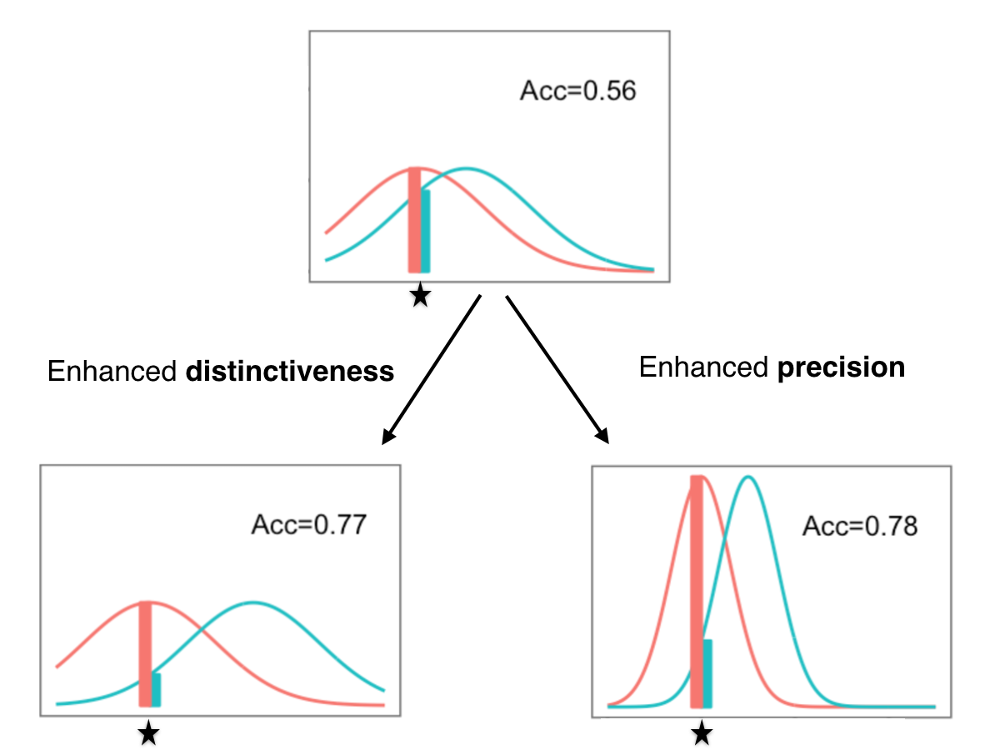
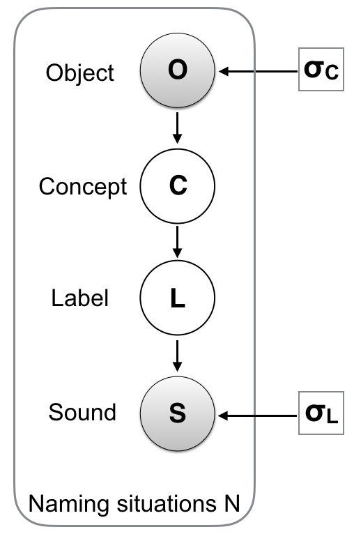
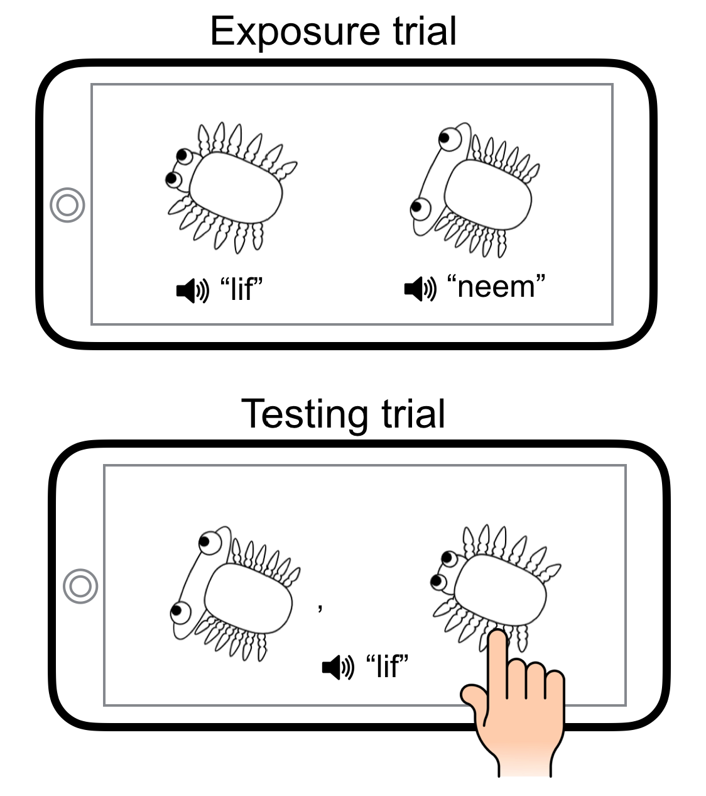

```{r}
knitr::opts_chunk$set(echo=F, warning=F, cache=F, message=F, sanitize = T)
```


```{r load_packages, include = FALSE}
library(papaja)
library(png)
library(grid)
library(ggplot2)
library(ggthemes)
library(xtable)
options(xtable.comment = FALSE)
library(purrr)
library(readr)
library(ggplot2)
#library(langcog)
library(boot)
#library(lazyeval)
library(dplyr)
library(tidyr)
library(wordbankr)
library(directlabels)
#library(scales)
library(stringr)
library(lmtest)
#library(rwebppl)
library(jsonlite)
library(nlme)
library(feather)
library(broom)
library(HDInterval)
library(BBmisc)
library(stargazer)
library(lme4)
library(kableExtra)
```

# Introduction

Cognitive development is often characterized in terms of a succession of discontinuous stages. In Piaget's initial conception, these stages cross-cut different aspects of cognition [@piaget1954]; in more modern conceptions, distinct domains are often thought to progress on their own timeline [e.g., @carey2015]. Although intuitively appealing, this sort of stage theory can be challenging to integrate with theories of learning, which typically posit that knowledge and skills improve incrementally with experience. Indeed, one of the central challenges of cognitive development has been to explain transitions between stages which appear to be qualitatively different [@carey2009].

Nevertheless, at least in some cases, development may only appear to be stage-like. Some discontinuities may be related to how we measure a specific skill. Other discontinuities may emerge due to statistical thresholding (e.g., an experimental p-value of $p < .05$ for one age group but not another) which can create a spurious dichotomy between success and failure in observing a given behavior. In such cases, positing discontinuous stages is unnecessary. Instead, a continuous model --- involving similar representations across the lifespan --- may provide a simpler and more transparent account of development [cf. @McMurray2007; @shultz1995].

To explore this point computationally, we use a case study from word learning literature. @stager1997 first showed that children's early ability to distinguish similar sounds does not automatically translate into word learning skills. The authors measured word learning using an audio-visual habituation Switch task. First, infants are familiarized with two word-object pairings (e.g., label 1 with object 1 and label 2 with object 2). Second, they are tested using two types of trials. The control 'same' trial consists of a correct pairing  (e.g., label 1 with object 1) and the 'switch' trial consists of a wrong pairing (e.g., label 1 with object 2). If babies have correctly learned the association during the habituation, they are supposed to be surprised by the 'switch' trial and not by the 'same' trial. The former should thus result in a greater looking time compared to the latter [@werker1998].

Though infants around 14-month old can distinguish perceptually similar sound pairs such as "dih" and "bih", they appear to fail in mapping this pair to two different objects in the switch task. This failure was initially taken as evidence that 14-month olds do not encode subtle sounds during meaning learning [@stager1997; @pater2004]. This interpretation suggested a discontinuous/stage-like pattern of development whereby younger children fail to encode the contrastive phonetic detail, whereas older children, around 17 months, typically do [@werker2002].

<!-- In fact, @stager1997 noted that "Infants of 14 months fail to detect the same phonetic detail that they can easily detect in a simple syllable discrimination task". They argued that the high cogntive demands of the task make children experience a limitation in the amount of phonetic details they can access. In a similar vein, Pater et al. (2004) argued that "when a contrast is first acquired, it is not stable and can be lost under processing demands"-->


<!--Follow-up studies has focused mainly on proposing possible explanations for the observed gap between speech perception and word learning [e.g., @fennell2010; @stager1997; @hofer2017; @rost2009]. -->

The initial discontinuous interpretation has been challenged by subsequent work. For instance, @yoshida2009 investigated whether failure in the Switch task reflects a lack of sound encoding during *habituation*, or whether it is only due to the nature of the *testing* method which does not allow learning below a certain threshold to be detected. They used the same habituation procedure as @stager1997, but instead of comparing the looking times in 'same' and 'switch' trials, they tested infants using a two-alternative choice task comparing fixations to target and distractor objects [@golinkoff1987; @fernald2006]. Using this testing method, researchers found evidence for learning even in 14-month olds.

Another challenge to the discontinuous account of development came from adult studies. If the mismatch between sound discrimination and word learning is only a stage in early infancy, then this mismatch should disappear by adulthood. Nonetheless, even adults show patterns of learning that mirror those shown by 14-month-olds when the sound contrasts are more challenging [@white2013; @pajak2016].

Some researchers [@swingley2007; @yoshida2009; @pajak2016] proposed that word knowledge may not be encoded in a binary fashion, i.e., it is not the case that children either succeed or fail in encoding minimal contrast when learning the meanings. Rather, they may be encoding this knowledge in a graded fashion (see @Munakata2001 for a detailed discussion of a similar view). Thus, development does not so much involve a qualitative shift (i.e., a sudden emergence of an ability that did not exist before) as much as it consists in the continuous refinement of initially noisy knowledge. 

Many different computational formalisms can represent graded knowledge. Here we use probabilistic models, a formalism that allows both easy examinations of internal representations and quantification of the robustness of these representations. Our goal here is an exploration at the highest level of abstraction, in which we attempt to characterize the computational constraints that might lead to a particular behavior [@marr1982]. We characterize word knowledge by a probability distribution in a similarity space. The probability is highest at the most typical sound instance of the word. It decreases as the instance becomes less typical. The precision of word knowledge can be characterized by whether it tolerates slightly atypical pronunciations. This tolerance is captured formally by the variance of the probability distribution: larger variance indicates higher tolerance and lower precision, whereas smaller variance indicates lower tolerance and higher precision (for an illustration, see Figure \@ref(fig:illus) top and right panels). 

This general framework --- in which the precision of word knowledge is characterized with the variance of a probability distribution --- can already provide an intuitive way of thinking about several findings. In particular, unlike the binary view, the probabilistic view allows for the possibility of word knowledge being both successful and noisy. This new understanding can provide an account for the fact that children show evidence of learning in some testing conditions [e.g., @yoshida2009] but not in others [e.g., @stager1997] --- depending on the precision of the measurement.

In a word-pair learning paradigm, children are supposed to associate one label, e.g., "bih", with object 1 and a second label, e.g., "dih", with object 2.  Infants may succeed in learning both associations. Nevertheless, the variance with which the pair of words are encoded can still be large, causing their probability distributions to overlap (Figure \@ref(fig:illus), top). The way this (noisy) knowledge is probed can lead to different results. 

In the Switch task [@stager1997], children are understood to succeed if they reject a wrong association (e.g., "bih" with object 2). However, a large overlap between "bih" and "dih" means that "bih" is itself a plausible mispronunciation of "dih". The wrong association may not be rejected by children because the speaker could have said "bih" but meant "dih". In the two-alternative choice task [@yoshida2009], children do not have to reject the wrong association; they only need to show a preference, albeit small, for the correct one. Thus, unlike the Switch, this testing method allows us to see subtle evidence of learning even with a large overlap. For example, given the label "bih", children are supposed to pick which object is a better match to this label. Though it is possible that the speaker said "bih" and meant "dih", it is *more* likely that the speaker both said and meant "bih" --- this higher probability leads to a preference for the correct object. 

In addition to providing a potential explanation of the difference in behavior across the Switch and the preferential looking tasks, the probabilistic account explains differences in behavior within the same task. In particular, when the labels are quite distinct in the perceptual space ("lif" vs. "neem"), the probabilistic distributions do not overlap as much as in the case of similar-sounding words (Figure \@ref(fig:illus), left). This fact means that the learners will have less tolerance for the wrong association, leading to a successful rejection in the Switch task (as was reported by @stager1997 and subsequent studies using the same paradigm). Further, distinctiveness can be enhanced even for minimally different sounds when other cues highlight their difference [@rost2009; @rost2010; @thiessen2007; @yeung09; @dautriche2015]. 

In this framework, developmental change can be understood as an increase in the precision (i.e., a decrease in the variance) of the probabilistic knowledge, leading to a lower overlap between the distributions of similar-sounding words (Figure \@ref(fig:illus), right).  Importantly, a more precise representation still has a non-zero variance. Thus, learning difficulties can still be induced with challenging stimuli or in cognitively demanding situations, as has been demonstrated in adult studies [@white2013; @pajak2016]. 

## The current study

A probabilistic account has been described before to explain patterns of learning and development at the qualitative level [e.g.,@swingley2007]. However, it is crucial to have a precise computational instantiation of this account which can help us 1) test this theoretical hypothesis more directly and 2) identify the particular parameters that are the locus of developmental change.  One previous study attempted to provide such a computational instantiation [@hofer2017]. However, this previous work aimed more at reproducing the results of a specific study [@pajak2016], which focused on explaining the mismatch between speech perception and word learning in adults rather than on exploring the mechanism of development.

The present work proposes a model of developmental change in word-pair learning based on the probabilistic account. We tested the ability of this model to both *explain* various findings in previous experiments in both children and adults (e.g., the fact that similar words are harder to learn than different words) and to *predict* new learning patterns that have not been tested before. In particular, we test the prediction that referent similarity (i.e., the confusability of pictures referred to by novel words) should play an identical computational role to word form similarity in predicting word recognition difficulty.
Previous work in this line of research has studied the effect of several bottom-up and top-down properties on improving learning [e.g., @fennell2010; @rost2009; @thiessen2007] but the effect of the referent similarity remains to be tested. While some researchers studied this effect on wordform learning [@Zhao2019; @fourtassi2019; @yeung09], to our knowledge, the effect on children's word-object mapping has not been investigated before. Finally, we explore the extent to which the probabilistic account allows us to understand development in terms of as a continuous refinement in similar representations across the lifespan.

The paper is organized as follows. First, we introduce the model and we explain how it allows us to characterize behavior in a word-pair-learning paradigm. Then we explore the predictions of the model through simulating its behavior across different parameter settings. Next, we quantify the extent to which the model's predictions account for human data we collected from both preschool children and adults. Finally, we discuss the results in light of existing accounts of word development. 

```{r illus, fig.cap = "An illustration of the probabilistic/continuous account using simulated data. A word is represented with a distribution over the perceptual space (indicated in red or blue). When the uncertainty of the representation is large relative to the distance between the stimuli (top panel), an instance of the red category (indicated with a star) could also be a plausible instance of the green category, hence the low recognition accuracy score. The accuracy is higher when the stimuli are less similar (left panel), or when the representation are more precise (right panel).", fig.align = "center", out.width = "300px"}

```

# Model 

<!--In previous studies, only the similarity of the sounds was varied across conditions (e.g., "bin"/"din" vs. "lif"/"neem"). In our task, we also vary the visual similarity of the objects, which allows us to explore the effect of additional probabilistic cues on novel word learning and recognition. An overview of the task is presented in Figure XX. -->

## Probabilistic structure

Our model consists of a set of variables describing the general process of spoken word recognition in a referential situation. These variables are related in a way that reflects the simple generative scenario represented graphically in Figure \@ref(fig:model). When a speaker utters a sound in the presence of an object, the observer assumes that the object $o$ activated the concept $C$ in the speaker's mind. The concept prompted the corresponding label $L$. Finally, the label was physically instantiated by the sound $s$. 

```{r model, fig.cap = "Graphical representation of our model. Circles indicate random variables (shading indicates observed variables). The squares indicate fixed model parameters.", fig.align = "center", out.width = "150px"}

```

A similar probabilistic structure was used by @lewis2013 to model concept learning, and by @hofer2017 to model spoken word learning. However, the first study assumed that the sounds are heard unambiguously, and the second assumed the concepts are observed unambiguously. In our model, we make the --- more realistic --- assumption that both labels and concepts are characterized with distributions and that the distributions of neighboring categories may overlap.  In other words, we allow the model to account for the possibility that an instance of a given category (e.g.,"bih") can be mistaken for an instance of a neighboring category (e.g., "dih"), albeit with a smaller probability. We assume, for simplicity, that this probability is captured by a normal distribution\footnote{We used a normal distribution to simplify the mathematical derivations. This is obviously not aimed at providing a precise representation for the word-forms (and even less so for the visual objects), but as we shall see in the results section, this simplified representation was enough to quantify the confusability of a given stimulus with its neighbors, which is the quantity we needed to predict the accuracy of word-object mapping in our task.}:

\begin{equation} \label{eq:object}
 p(o | C) \sim  \mathcal{N}(\mu_C, \sigma^2_C) 
\end{equation}

\begin{center}
and 
\end{center}

\begin{equation} \label{eq:sound}
p(s| L) \sim  \mathcal{N}(\mu_L, \sigma^2_L)
\end{equation}

Finally, we assume there to be one-to-one mappings between concepts and labels and that observers have successfully learned these mappings during the exposure phase:
\begin{equation}\label{eq:mapping}
P(L_i|C_j) = 
\begin{cases}
  1 & \text{if  }  i=j \\  
  0  & \text{otherwise  }
\end{cases}
\end{equation}


## Inference

In our canonical inference case, the learner hears a sound $s$ and has to decide which object $o$ provides an optimal match to this sound (see Figure \@ref(fig:task)). To this end, they must compute the probability $P(o|s)$ for all possible objects. This probability can be computed by summing over all possible concepts and labels:

\begin{equation}
P(o|s)=\sum_{C,L} P(o, C, L| s)  
\end{equation}

Using the fact that $P(o,C,L|s) = \frac{P(o,C,L,s)}{P(s)}$ and that $P(s)$ does not depend on $o$, we arrive at the equation:

\begin{equation}
P(o|s) \propto \sum_{C,L} P(o, C, L, s) 
\end{equation}

The joint probability $P(o,C,L,s)$ is obtained by factoring the graphical model in Figure \@ref(fig:model):

$$P(o,C,L,s) = P(s|L)P(L|C)P(C|o)P(o)$$

Using Bayes' rule, we can rewrite $P(C|o)$ in terms of $P(o|C)$: 

$$P(C|o) = \frac{P(o|C)P(C)}{P(o)}$$ 

By subtituting this term in the expression of the joint distribution $P(o,C,L,S)$ we obtain:

$$P(o,C,L,s) = P(s|L)P(L|C)P(o|C)P(C)$$

Finally, assuming that the concepts' prior probability $P(C)$ is uniformly distributed,\footnote{This is a reasonable assumption in our particular case given the similarity of the concept pairs used in each naming situation in the experiment.} we obtain the following expression, where all conditional dependencies are now well defined:

\begin{equation} \label{eq:general}
P(o|s) \propto \sum_{C,L}  P(s|L)P(L|C)P(o|C)
\end{equation}

## Task and model predictions 

```{r task, fig.env = "figure", fig.pos = "t", fig.align='center', fig.width=4, fig.height=3, fig.cap = "An overview of the task used in this study."}



```

We use the model to predict word learning in a task similar to the one introduced by @stager1997. We used a modified version of the task where the testing method consists in a two-alternative forced-choice [@yoshida2009]. In this task, participants are first exposed to two different word-object pairings (e.g., "lif" - object 1, "neem" - object 2). The word-object associations are introduced sequentially. After this exposure phase, participants perform a series of test trials. In each of these trials, one of the two sounds is uttered (e.g., “lif”) and participants choose the corresponding object from the two alternatives. An overview of the task is shown in Figure \@ref(fig:task).

From the general expression \ref{eq:general}, we derive three exact analytical solutions instantiating different learning assumptions (see the Appendix for the full mathematical derivation).

### Model 1

 Recall from expressions \ref{eq:object} and \ref{eq:sound} that $P(o|C)$ and $P(s|L)$ have parameters $\sigma_C$ and $\sigma_L$, respectively, that control for uncertainty. The first solution/model is derived by assuming that the labels are recovered from sounds with a certain level of uncertainty $\sigma_L > 0$, but that concepts are unambiguously recovered from the observed objects, i.e., $\sigma_C \rightarrow 0$. This assumption has been made --- whether implicitly or explicitly --- by most previous work in this line of research. For example, in @stager1997, the objects were quite dissimilar. Thus, the assumption that they were easily discriminated by infants seems relatively well justified. One important implication of this assumption is that only the similarity of word sounds modulates performance in word learning, not the similarity of the referents (as long as these referents are differentiated perceptually). 
 
Using this assumption, we can simplify the general Equation \ref{eq:general} of the probability $P(o_i | s_i)$ of choosing the correct object $o_i$ given the correspondding label instance $s_i$:

\begin{equation} \label{eq:model1}
P(o_i|s_i)= \frac{1}{1 + e^{-\frac{\Delta s^2}{2\sigma_L^2}}}
\end{equation}

where $\Delta s = s_2-s_1$ is the perceptual sound distance between the pair of sounds that we refer to as $s_1$ and $s_2$. 

### Model 2

The second solution/model is derived from Equation \ref{eq:general} by making the more general assumption that both the labels and the concepts are recovered with uncertainty from the sounds and objects, but we introduce the simplifying assumption that the label-related uncertainty $\sigma_L$ and the concept-related uncertainty $\sigma_C$ are of a similar magnitude, i.e., $\sigma_C \approx \sigma_L = \sigma$. This simplifying assumption makes the prediction that the sound similarity and the object similarity impact word learning accuracy in exactly the same way. Furthermore, it allows us to study the behavior of the model with only one free parameter, an important consideration given the small number of datapoints available from any given developmental experiment.

\begin{equation} \label{eq:model2}
P(o_i|s_i)= \frac{1 + e^{- \frac{\Delta s^2 + \Delta o^2}{2\sigma^2}}}{1 + e^{-\frac{\Delta s^2 + \Delta o^2}{2\sigma^2}}+ e^{-\frac{\Delta s^2}{2\sigma^2}} + e^{-\frac{\Delta o^2}{2\sigma^2}}}
\end{equation}

### Model 3

We finally derive the third (and most general) solution which allows label- and concept-related uncertainties to vary independently. 

\begin{equation} \label{eq:model3}
P(o_i|s_i)= \frac{1 + e^{- (\frac{\Delta s^2}{2\sigma_L^2}+ \frac{\Delta o^2}{2\sigma_C^2})}}{1 + e^{-(\frac{\Delta s^2}{2\sigma_L^2}+ \frac{\Delta o^2}{2\sigma_C^2})}+ e^{-\frac{\Delta s^2}{2\sigma_L^2}} + e^{-\frac{\Delta o^2}{2\sigma_C^2}}}
\end{equation}

In order to understand the predictions of the models (especially the more general ones, i.e., Model 2 and 3), Figure \ref{fig:simulation} show simulations of the accuracy $P(o_i|s_i)$ as a function of the distinctiveness parameters ($\Delta s$ and $\Delta o$) and the uncertainty parameters $\sigma_L$ and $\sigma_C$.  


```{r, echo=FALSE}
pdf.options(encoding='CP1250')
```

```{r }

#Import data from saved
simulations <- feather::read_feather("../saved_data/simulations.feather") %>%
  mutate(obj = ifelse(object_distance == "0.25", "\u0394o = 0.25",
                      ifelse(object_distance == "0.5","\u0394o = 0.5",
                             "\u0394o = 1")))

plot_simulation <- ggplot(simulations, aes(x=x, y=y, col=sigma)) + 
  geom_line() + 
  theme_few()+
  theme(legend.title = element_text(size=11),
      legend.text=element_text(size=11),
      axis.text = element_text(size = 8),
      aspect.ratio = 0.7
      )+
  #plot.margin=grid::unit(c(0,0,0,0), "mm")
  ylim(c(0.4,1))+
  geom_hline(yintercept = 0.50, linetype="dashed") +
  xlab(expression(Delta*"s")) + ylab(expression("P("*o['i']*"|"*s['i']*")")) +
  facet_grid(.~obj) +
  #facet_grid(.~object_distance) +
  scale_color_discrete(name = expression(sigma))
  
```

```{r simulation, fig.cap = "The predicted probability of accurate responses in the testing phase as a function of stimuli distinctiveness $\\Delta s$ and $\\Delta o$ and representation precision $\\sigma$ (For simplicity, we use model 2, which assumes that $\\sigma$=$\\sigma_C$=$\\sigma_L$). Dashed line represents chance."}
plot_simulation

```

The simulations explain two experimental results from previous studies and make one new prediction:

1) For fixed values of $\Delta o$ and  $\sigma$, the probability of accurate responses increases as a function of $\Delta s$. This pattern accounts for the fact that similar sounds are generally more challenging to learn than different sounds for both children [@stager1997] and adults [@pajak2016]. 

2) For fixed values of $\Delta s$ and $\Delta o$, accuracy increases when the representational uncertainty $\sigma$ decreases. This observation provides a simple model for developmental change. Younger children have noisier representations [see @swingley2007; @yoshida2009], which leads to lower word recognition accuracy, especially for similar-sounding words.

3) For fixed values of $\Delta s$ and $\sigma$, accuracy increases with the visual distance between the semantic referents $\Delta o$. 

<!--This is a new prediction that our model makes. Previous work studied the effect of several bottom-up and top-down properties on word meaning learning [e.g., @fennell2010; @rost2009; @thiessen2007] and the effect of , but to our knowledge, no previous study in the literature tested the effect of the visual distance between the semantic referents. -->

# Experiment

In this experiment, we tested participants in the word learning task introduced above (Figure \@ref(fig:task)). More precisely, we explored the predictions related to both distinctiveness and precision. Sound similarity ($\Delta s$) and object similarity ($\Delta o$) were varied simultaneously in a within-subject design. Two age groups (preschool children and adults) were tested on the same task^[This four-condition within-subject design is somewhat unusual for preschoolers, but we followed the tablet paradigm [e.g., @frank2016] which allowed us to gather a relatively large number of trials from each child.] to explore whether development can be characterized with the uncertainty parameters, $\sigma_C$ and $\sigma_L$. The experiment, sample size, exclusion criteria, and the model's main predictions were pre-registered.\footnote{Due to the double-blind review, the link to the osf repository is only provided in the full version addressed to the editor.}

```{r}
#Sample size

#Children:

d_child <- read_delim("../Analysis/kids_all_final.txt", delim = " ") %>%
  filter(type == "Test") %>%
  filter(age != 6) %>%
  filter(code != 'test',
         !is.na(code)) %>%
  filter(grepl('soph', code)) %>%
  mutate(iscorrect=ifelse(answer==correct, 1, 0))

d_child_score <- d_child %>%
  group_by(ID, sound_dist, concept_dist) %>%
  dplyr::summarise(mean = mean(iscorrect))

#Catch
d_child_excl <- d_child_score %>%
  filter(sound_dist == 'catch') %>%
  ungroup() %>%
  select(ID, mean) %>%
  dplyr::rename(score = mean)

d_child_good <- d_child %>%
  left_join(d_child_excl) %>%
  filter(score > 0.5) %>%
  filter(sound_dist != 'catch')

N_all_ch <- d_child %>% distinct(ID) %>% nrow()
N_good_ch <- d_child_good %>% distinct(ID) %>% nrow()


#Adults

d_adult <- read_delim("../Analysis/adults_100.txt", delim = " ")  %>%
  filter(type == "Test") %>%
  mutate(iscorrect=ifelse(answer==correct, 1, 0)) 

d_adult_lang <- d_adult %>% #Here I will  filter out particiapants whose first language is arabic or hindi
  filter(other == "yes") %>% distinct(ID) %>% nrow()

d_adult_score <- d_adult %>%
  group_by(ID, sound_dist, concept_dist) %>%
  dplyr::summarise(mean = mean(iscorrect))

d_adult_excl <- d_adult_score %>%
  filter(sound_dist == 'catch') %>%
  ungroup() %>%
  select(ID, mean) %>%
  dplyr::rename(score = mean)
  #select(ID, score)
  
d_adult_good <- d_adult %>%
  left_join(d_adult_excl) %>%
  filter(other != "yes") %>%
  filter(score >0.7) %>%
  filter(sound_dist != 'catch')

N_all_ad <- d_adult %>% distinct(ID) %>% nrow()
N_good_ad <- d_adult_good %>% distinct(ID) %>% nrow()

```

## Methods

### Participants

We report data from $N=$ `r N_good_ch` children ages 4-5 years from a nursery school. An additional $N=$ `r N_all_ch-N_good_ch` children participated but were removed from analyses using a preregistered exclusion criterion of not being above chance on the catch trials.\footnote{The number of children who were excluded is a bit high for this age group. This is partly due to our adoption of a 2x2 fully within-subject design, which was demanding for children. As we explain below, we adopted this design based on pilot testing that indicated that precision of measurement was critical for testing our experimental predictions.} We also report data from $N=$ `r N_good_ad` adult participants tested on Amazon Mechanical Turk. An additional $N=$ `r N_all_ad-N_good_ad` were tested but removed from analyses using preregistered exclusion criteria of either having a low score on the catch trials or being familiar with the non-English sound stimuli we used in the adult experiment.

### Stimuli and similarity rating
The sound stimuli were generated using the MBROLA Speech Synthesizer [@dutoit1996]. We generated three kinds of nonsense word pairs which varied in their degree of perceptual similarity to English speakers: 1) *different* pairs: "lif"/"neem" and "zem"/"doof", 2) *intermediate* pairs: "aka"/"ama" and "ada"/"aba", and 3) *similar* non-English pairs\footnote{For the intermediate/similar pairs, we made the choice of using a VCV (Vowel-Consonant-Vowel) structure in order to emphasize the phonemic difference in the minimal pairs, especially for the non-native contrasts. However, as one reviwer rightfully pointed out to us, this structure could influence word leaning performance since it is not common in English. Nevertheless, if we observed this effect, we would have seen differences in predictability between the intermediate/similar pairs on the one hand, and different pairs (which are phonotactically common in English) on the other hand. However, this was not the case; word learning accuracy was correctly predicted based on perceptual similarity alone.}: "ada"/"a\textipa{d\super h}a" (in hindi) and "a\textipa{Q}a"/"a\textipa{\textcrh}a" (in arabic). For the similar pairs, we used non-native sounds because this was a good way to decrease perceptual similarity for adults. In this respect, we took inspiration from the work of @pajak2016. We refer the reader to that paper for a lengthy discussion of the literature on (and implications for) L2 phoneme perception.

As for the objects, we used the Dynamic Stimuli javascript library\footnote{https://github.com/erindb/stimuli} which allowed us to generate objects in four different categories: "tree," "bird," "bug," and "fish." These categories were described to participants as naturally occurring kinds on an alien planet. In each category, we generated *different*, *intermediate*, and *similar* pairs by manipulating a continuous property controlling features of the category's shape (e.g., body stretch or head fatness).  

In order to validate and quantify our similarity scales, we ran a separate survey on Amazon Mechanical Turk where we asked $N=20$ adult participants to evaluate the similarity of each sound and object pair on a 7-point scale. Data are shown in Figure \@ref(fig:stim) where we scaled responses within the range [0,1] for each stimulus group. We used these data in all models as an empirical measurement of the perceptual distance between the sound pairs and the object pairs. The use of empirical measurement allows us to eliminate $\Delta s$ and $\Delta s$ as free parameters (see @frank2012 and @xu2007 for a similar strategy).

<!--Though these distances were collected from adults particiapants only, we make the assumption that they measure an perecptual distances represent the "objective" for both adults and children and that only the way these sounds are paired to object vary across age groups.-->


```{r}
sim_transform <- feather::read_feather("../saved_data/d_sim_process.feather")

sim_plot <- ggplot(sim_transform, 
      aes(x = labels, y = mean, group = factor(stimuli), col=factor(stimuli))) +
  #geom_point(size=2)+
  geom_line()+
  geom_pointrange(aes(ymin = lower, ymax = upper), 
                 position = position_dodge(width = .1),
                 size=0.2) + 
  scale_colour_discrete(name="Stimuli")+
  theme_few()+
theme(legend.title = element_text(size=7.5),
      legend.text=element_text(size=7.5),
      axis.text = element_text(size = 7.5),
      strip.text = element_text(size = 7.5),
      axis.title = element_text(size = 7.5),
      aspect.ratio = 0.7
      ) +
  ylim(c(-0.1,1.2))+
  scale_y_continuous(breaks = c(0,0.25,0.5, 0.75,1))+
  #ylim(c(0,1.2)) +
  xlab("Stimulus group")+ ylab("Perceptual distance (empirical)") 

```

```{r }

#Import data from saved
data_human_model <- feather::read_feather("../saved_data/data_human_model.feather") %>%
  mutate(key = ifelse(key == "prediction_no", "Model 1",
                      ifelse(key == "prediction", "Model 2", "Model 3")))


data_human_model$group <- factor(data_human_model$group, levels = c("children", "adults"))
#data_human_model$Model <- factor(data_human_model$Model, levels = c("Single Variance", "Double Variance"))

plot_data <- ggplot(data_human_model, 
      aes(x = sound_dist, y = human, group = factor(concept_dist), col = factor(concept_dist))) +
  geom_point()+
  geom_pointrange(aes(ymin = lower, ymax = upper), 
                 position = position_dodge(width = .1),
                 size=0.2) + 
  geom_line() + 
  geom_line(aes(x=sound_dist, y=value), 
            position = position_dodge(width = .2),
            linetype=2,
            size=0.5)+
  geom_point(aes(x=sound_dist, y=value),
             position = position_dodge(width = .2),
             size=1.5, alpha=0.5)+
  geom_hline(yintercept = 0.50, linetype="dashed") +
  xlab("Auditory similary") +ylab("Accuracy")+
  #scale_colour_discrete(name="Visual similarity")+
  theme_few()+
  ggthemes::scale_color_ptol(name="Visual similarity")+
theme(legend.title = element_text(size=11),
      legend.text=element_text(size=11),
      axis.text = element_text(size = 11)
      #) + facet_grid(group~source, scales="free_y") +
      ) + facet_grid(key~group) +
  theme(aspect.ratio = 0.7)+
  ylim(c(0.45,1))
  
```

### Design 

Each age group saw only two of the three levels of similarity described in the previous sub-section: *different* vs. *intermediate* for the preschoolers, and *intermediate* vs. *similar* for adults. We made this choice in light of pilot studies showing that adults were at ceiling with *different* sounds/objects, and children were at chance with the *similar* sounds/objects. That said, this difference in the level of similarity is accounted for in the model: We used empirical distance measurement to fill in the appropriate values of $\Delta s$ and $\Delta o$ for each age group. 

```{r stim, fig.env = "figure", fig.pos = "h", fig.align='center', fig.width=4, fig.height=3, fig.cap = "Distances for sound and object pairs ($\\Delta s$ and $\\Delta o$, respectively) from an adult norming study. Data represent Likert values normalized to [0,1] interval. Error bars represent 95\\% confidence intervals."}

sim_plot

```


To maximize our ability to measure subtle stimulus effects, the experiment was a 2x2 within-subjects factorial design with four conditions: high/low sound similarity crossed with high/low visual object similarity. Besides the four conditions, we also tested participants on a fifth catch condition which was similar in its structure to the other ones but was trivially easy and used only to select participants who were able to follow the instructions and show minimal learning. 


### Procedure

Preschoolers were tested at the nursery school using a tablet, whereas adults used their own computers to complete the same experiment online. Participants were tested in a random sequence of five conditions: the four experimental conditions plus the catch condition. In each condition, participants saw a first block of four exposure trials followed by four testing trials, and a second block of two exposure trials (for memory refreshment) followed by an additional four testing trials. The length of this procedure was demanding, especially for children, but we adopted a fully within-subjects design based on pilot testing that indicated that precision of measurement was critical for testing our experimental predictions.

In the exposure trials, participants saw two objects associated with their corresponding sounds. We presented the first object on the left side of the tablet's screen simultaneously with the corresponding sound. The second sound-object association followed on the other side of the screen after 500ms. For both objects, visual stimuli were present for the duration of the sound clip (about 800ms). During this phase, participants were asked to pay attention and try yo lean the words. In the testing trials, participants saw both objects simultaneously and heard only one sound. They completed the trial by selecting which of the two objects corresponded to the sound. The object-sound pairings were randomized across participants, as was the order of the conditions (except for the catch condition which was always placed in the middle of the testing sequence). We also randomized the on-screen position (left vs. right) of the two pictures on each testing trial. 

```{r allData, fig.env = "figure", fig.pos = "h", fig.align='center', fig.cap = "Accuracy of word recognition as a function of the sound distance, the object distance, and the age group (preschool children vs. adults). We show both the models' predictions (dashed lines) and the experimental results (solid lines, same across the three panels). Error bars represent 95\\% confidence intervals."}

plot_data
```

## Results

```{r, results='asis'}

model_coef <- feather::read_feather("../saved_data/model_regression.feather")

p_val <- function(val) {
  if(val < 0.001) 
    {'< 0.001'} 
  else if(val < 0.01)
    {'<0.01'} 
  else if(val < 0.05)
    {'<0.05'} 
  else {paste('=', round(val,2))}
}

s_coef <- round(model_coef$Estimate[which(model_coef$effect=="s_dist")],2)
s_p = model_coef$'Pr(>|z|)'[which(model_coef$effect=="s_dist")]

c_coef <- round(model_coef$Estimate[which(model_coef$effect=="c_dist")],2)
c_p = model_coef$'Pr(>|z|)'[which(model_coef$effect=="c_dist")]

age_coef <- round(model_coef$Estimate[which(model_coef$effect=="age")],2)
age_p = model_coef$'Pr(>|z|)'[which(model_coef$effect=="age")]

c_s_coef <- round(model_coef$Estimate[which(model_coef$effect=="s_dist:c_dist")],2)
c_s_p = model_coef$'Pr(>|z|)'[which(model_coef$effect=="s_dist:c_dist")]

s_age_coef <- round(model_coef$Estimate[which(model_coef$effect=="s_dist:age")],2)
s_age_p = model_coef$'Pr(>|z|)'[which(model_coef$effect=="s_dist:age")]

c_age_coef <- round(model_coef$Estimate[which(model_coef$effect=="c_dist:age")],2)
c_age_p = model_coef$'Pr(>|z|)'[which(model_coef$effect=="c_dist:age")]

```

```{r results='asis'}

#Binomoial test to show that children are not different from chance at the most difficult condition
rand_stat <- d_child_good %>%
  filter(sound_dist == "similar" & concept_dist == "similar")

myVar <- rand_stat$iscorrect
k <- sum(myVar)
n <- length(myVar)

myTest0 <- binom.test(k,n, 0.5)


rand_plus_stat <- d_child_good %>%
  filter(sound_dist == "similar" & concept_dist == "different")

myVar <- rand_plus_stat$iscorrect
k <- sum(myVar)
n <- length(myVar)

myTest1 <- binom.test(k,n, 0.5)

```

Experimental results are shown in Figure \@ref(fig:allData) (solid lines). We first analyzed the results using a mixed-effects logistic regression with sound distance, object distance and age group as fixed effects, and with a maximal random effects structure (allowing us to take into account the full nested structure of our data) [@barr2013]. We found main effects for all the fixed effects in the regression. For the sound distance, we obtained $\beta =$ `r s_coef` ($p$ `r p_val(s_p)`), replicating previous findings that sound distance modulates success in word learning [e.g., @stager1997]. 

For object distance, we found $\beta =$ `r c_coef`  ($p$ `r p_val(c_p)`), and this finding confirms the new prediction of our model, according to which, object distance also modulates performance in word learning. Finally, for the age group, we obtained  $\beta =$ `r age_coef` ($p$ `r p_val(age_p)`), showing that overall performance improves with age. The full output of the regression model is shown in Table 2. 


```{r}

data_correlations <- feather::read_feather("../saved_data/data_correlations.feather")

R2_model1 <-  round(cor(data_correlations$human, data_correlations$prediction_no)^2, 2)
R2_model2 <-  round(cor(data_correlations$human, data_correlations$prediction)^2, 2)
R2_model3 <-  round(cor(data_correlations$human, data_correlations$prediction_2)^2, 2)

mod0_val <- feather::read_feather("../saved_data/values_mod_no.feather") %>%
  rename(lower =`2.5 %`,
         upper = `97.5 %`)

mod1_val <- feather::read_feather("../saved_data/values_mod1.feather") %>%
  rename(lower =`2.5 %`,
         upper = `97.5 %`)
  
mod2_val <- feather::read_feather("../saved_data/values_mod2.feather") %>%
  rename(lower =`2.5 %`,
         upper = `97.5 %`)

```


```{r models, results="asis", echo=FALSE}


##Children
mod1_ch_val = toString(round(mod0_val$val[which(mod0_val$group=="children")],2))
mod1_ch_conf1 = toString(round(mod0_val$lower[which(mod0_val$group=="children")],2))
mod1_ch_conf2 = toString(round(mod0_val$upper[which(mod0_val$group=="children")],2))

mod1_ch = paste(mod1_ch_val, paste('[',mod1_ch_conf1,',', mod1_ch_conf2, ']', sep =''))

mod2_ch_val = toString(round(mod1_val$val[which(mod1_val$group=="children")],2))
mod2_ch_conf1 = toString(round(mod1_val$lower[which(mod1_val$group=="children")],2))
mod2_ch_conf2 = toString(round(mod1_val$upper[which(mod1_val$group=="children")],2))

mod2_ch = paste(mod2_ch_val, paste('[',mod2_ch_conf1,',', mod2_ch_conf2, ']', sep =''))

mod3_ch_s_val = toString(round(mod2_val$val[which(mod2_val$group=="children" & mod2_val$param=="Vr_s")],2))
mod3_ch_s_conf1 = toString(round(mod2_val$lower[which(mod2_val$group=="children" & mod2_val$param=="Vr_s")],2))
mod3_ch_s_conf2 = toString(round(mod2_val$upper[which(mod2_val$group=="children" & mod2_val$param=="Vr_s")],2))

mod3_ch_s = paste(mod3_ch_s_val, paste('[',mod3_ch_s_conf1,',', mod3_ch_s_conf2, ']', sep =''))

mod3_ch_o_val = toString(round(mod2_val$val[which(mod2_val$group=="children" & mod2_val$param=="Vr_o")],2))
mod3_ch_o_conf1 = toString(round(mod2_val$lower[which(mod2_val$group=="children" & mod2_val$param=="Vr_o")],2))
mod3_ch_o_conf2 = toString(round(mod2_val$upper[which(mod2_val$group=="children" & mod2_val$param=="Vr_o")],2))

mod3_ch_o = paste(mod3_ch_o_val, paste('[', mod3_ch_o_conf1,',', mod3_ch_o_conf2, ']', sep =''))


##Adults 

mod1_ad_val = toString(round(mod0_val$val[which(mod0_val$group=="adults")],2))
mod1_ad_conf1 = toString(round(mod0_val$lower[which(mod0_val$group=="adults")],2))
mod1_ad_conf2 = toString(round(mod0_val$upper[which(mod0_val$group=="adults")],2))

mod1_ad = paste(mod1_ad_val, paste('[',mod1_ad_conf1,',', mod1_ad_conf2, ']', sep =''))

mod2_ad_val = toString(round(mod1_val$val[which(mod1_val$group=="adults")],2))
mod2_ad_conf1 = toString(round(mod1_val$lower[which(mod1_val$group=="adults")],2))
mod2_ad_conf2 = toString(round(mod1_val$upper[which(mod1_val$group=="adults")],2))

mod2_ad = paste(mod2_ad_val, paste('[',mod2_ad_conf1,',', mod2_ad_conf2, ']', sep =''))

mod3_ad_s_val = toString(round(mod2_val$val[which(mod2_val$group=="adults" & mod2_val$param=="Vr_s")],2))
mod3_ad_s_conf1 = toString(round(mod2_val$lower[which(mod2_val$group=="adults" & mod2_val$param=="Vr_s")],2))
mod3_ad_s_conf2 = toString(round(mod2_val$upper[which(mod2_val$group=="adults" & mod2_val$param=="Vr_s")],2))

mod3_ad_s = paste(mod3_ad_s_val, paste('[',mod3_ad_s_conf1,',', mod3_ad_s_conf2, ']', sep =''))

mod3_ad_o_val = toString(round(mod2_val$val[which(mod2_val$group=="adults" & mod2_val$param=="Vr_o")],2))
mod3_ad_o_conf1 = toString(round(mod2_val$lower[which(mod2_val$group=="adults" & mod2_val$param=="Vr_o")],2))
mod3_ad_o_conf2 = toString(round(mod2_val$upper[which(mod2_val$group=="adults" & mod2_val$param=="Vr_o")],2))

mod3_ad_o = paste(mod3_ad_o_val, paste('[', mod3_ad_o_conf1,',', mod3_ad_o_conf2, ']', sep =''))


mods <- data.frame(models = c('model 1', 'model 2', 'model 3'),
                   struc = c("$\\sigma$\\textsubscript{L} only",
                             "$\\sigma$\\textsubscript{L} = $\\sigma$\\textsubscript{C}",
                             "$\\sigma$\\textsubscript{L} $\\neq$ $\\sigma$\\textsubscript{C}"),
                   param = c(1,1,2),
                   R = c(R2_model1, R2_model2, R2_model3),
                   sigS_C = c(paste(mod1_ch_val, ' [', mod1_ch_conf1, ', ' , mod1_ch_conf2, ']', sep = ""),
                              paste(mod2_ch_val, ' [', mod2_ch_conf1, ', ' , mod2_ch_conf2, ']', sep = ""),
                              paste(mod3_ch_s_val, ' [', mod3_ch_s_conf1, ', ' , mod3_ch_s_conf2, ']', sep = "")
                              ),
                   sigO_C = c('--',
                              paste(mod2_ch_val, ' [', mod2_ch_conf1, ', ' , mod2_ch_conf2, ']', sep = ""),
                              paste(mod3_ch_o_val, ' [', mod3_ch_o_conf1, ', ' , mod3_ch_o_conf2, ']', sep = "")
                              ),
                   sigS_A = c(paste(mod1_ad_val, ' [', mod1_ad_conf1, ', ' , mod1_ad_conf2, ']', sep = ""),
                              paste(mod2_ad_val, ' [', mod2_ad_conf1, ', ' , mod2_ad_conf2, ']', sep = ""),
                              paste(mod3_ad_s_val, ' [', mod3_ad_s_conf1, ', ' , mod3_ad_s_conf2, ']', sep = "")
                              ),
                   sigO_A = c('--',
                              paste(mod2_ad_val, ' [', mod2_ad_conf1, ', ' , mod2_ad_conf2, ']', sep = ""),
                              paste(mod3_ad_o_val, ' [', mod3_ad_o_conf1, ', ' , mod3_ad_o_conf2, ']', sep = "")
                              
                   ))


kable(mods, format = "latex", escape = FALSE, booktabs = TRUE,
      linesep = "", format.args = list(big.mark = ","),
      caption = "Characteristics and performance of the models used in this study. Value ranges represent 95\\% confidence intervals.",
      col.names = c("Model",  "Structure", "Param.", "R\\textsuperscript{2}", "$\\sigma$\\textsubscript{L}", "$\\sigma$\\textsubscript{C}", "$\\sigma$\\textsubscript{L}", "$\\sigma$\\textsubscript{C}")) %>%
  add_header_above(c("", "","","","Children" = 2, "Adults" = 2)) %>%
  column_spec(1, bold = TRUE) %>%
  kable_styling(position = "center", latex_options="scale_down")

```

We next fit the three models obtained through expressions \ref{eq:model1}, \ref{eq:model2}, and \ref{eq:model3} to the population's mean responses in each age group, using a Nonlinear Least Squares algorithm. The predictions of the models are shown \@ref(fig:allData). The parameter estimates (for $\sigma_L$ and $\sigma_C$) as well as models' goodness to fit (i.e., measured through $R^2$) are presented in Table \@ref(tab:models). 

Model 1, which does not take into account ambiguity in recovering concepts from observed objects, explains only a small part of the variance. In contrast, Model 3, which does take into account this ambiguity, accounts for all the variance. Interestingly, Model 2 which has a single, shared uncertainty parameter for both auditory and visual modalities still explains almost all the variance in human data.

As predicted, the uncertainty parameters were larger for children than they were for adults (Table \@ref(tab:models)), showing that word knowledge gets more precise with development. Further, the parameter estimates of Model 3 show that this developmental effect is larger for labels ($\sigma_L$ varies between `r round(mod2_val$val[which(mod2_val$group=="children" & mod2_val$param=="Vr_s")],2)` in children and `r round(mod2_val$val[which(mod2_val$group=="adults" & mod2_val$param=="Vr_s")],2)` in adults) than it is for concepts ($\sigma_C$ varies between `r round(mod2_val$val[which(mod2_val$group=="children" & mod2_val$param=="Vr_o")],2)` in children and `r round(mod2_val$val[which(mod2_val$group=="adults" & mod2_val$param=="Vr_o")],2)` in adults).

<!-- The values of the parameters were as follows. Children had a label-specific uncertainty of $\sigma_S =$ `r round(mod2_val$val[which(mod2_val$group=="children" & mod2_val$param=="Vr_s")],2)` [`r round(mod2_val$lower[which(mod2_val$group=="children" & mod2_val$param=="Vr_s")],2)`, `r round(mod2_val$upper[which(mod2_val$group=="children" & mod2_val$param=="Vr_s")],2)`]\footnote{All uncertainty intervals in this paper represent 95\% Confidence Intervals.}, and a concept-specific uncertainty of $\sigma_C =$ `r round(mod2_val$val[which(mod2_val$group=="children" & mod2_val$param=="Vr_o")],2)` [`r round(mod2_val$lower[which(mod2_val$group=="children" & mod2_val$param=="Vr_o")],2)`, `r round(mod2_val$upper[which(mod2_val$group=="children" & mod2_val$param=="Vr_o")],2)`]. Adults had a label-specific uncertainty of $\sigma_S =$ `r round(mod2_val$val[which(mod2_val$group=="adults" & mod2_val$param=="Vr_s")],2)` [`r round(mod2_val$lower[which(mod2_val$group=="adults" & mod2_val$param=="Vr_s")],2)`, `r round(mod2_val$upper[which(mod2_val$group=="adults" & mod2_val$param=="Vr_s")],2)`], and a concept-specific uncertainty of $\sigma_C =$ `r round(mod2_val$val[which(mod2_val$group=="adults" & mod2_val$param=="Vr_o")],2)` [`r round(mod2_val$lower[which(mod2_val$group=="adults" & mod2_val$param=="Vr_o")],2)`, `r round(mod2_val$upper[which(mod2_val$group=="adults" & mod2_val$param=="Vr_o")],2)`].  As predicted, the uncertainty parameters were larger for children than they were for adults, showing that the probabilistic representations becomes more refined (that is, $\sigma$ becomes smaller) across development. The developmental effect was more important for the label-specific uncertainty. -->


# General Discussion

This paper explored the idea that some seemingly stage-like patterns in cognitive development can be characterized in a continuous fashion. We used as a case study the seminal work of @stager1997 showing a discrepancy between children's speech perception abilities and their word learning skills. The development of this discrepancy could be understood in terms of a discrete change in word representation. But our model demonstrates that it can also be parsimoniously described as a result of continuous developmental change in the precision of children's graded word knowledge. Our model thus provides a computational instantiation and test of the continuous development hypothesis proposed in previous work [@swingley2007; @yoshida2009; @pajak2016]. 

Our model used the assumption that the ability to distinguish two sounds perceptually leads to an accurate mapping of these sounds with two distinct objects, although this mapping can be noisy. On this account, apparent patterns of failure and success in retrieval tasks (such as ours) reflect different degrees of noise in the learned representations and not necessarily the presence/absence of these representations. With this assumption, the model was capable of accurately predicting behavior (including around-chance performance in the case of the most difficult contrasts)\footnote{That is, the case when both the sounds and objects are similar for children. Figure 6 shows that the confidence intervals include the chance value of 0.5.}, thus providing a proof of concept for the continuity hypothesis. The discontinuity hypothesis  --- which posits the absence of learning and not just retrieval difficulty --- cannot be ruled out by our model, but it is less parsimonious. We propose that the continuous hypothesis should be considered as a baseline; discontinuous development should only be posited if it deviates from this baseline.

We find in the literature two broad accounts of development in the ability to learn the meanings of similar-sounding words: One that suggests *direct* development of the sound representation and one that hypothesizes *indirect* development of this representation through improvement in general cognitive resources. On the first account, the sound representation becomes more precise as learners refine the boundaries of their initially ambiguous phonetic categories and as they gain more experience with the functional role of these categories [@yoshida2009; @dietrich2007; @rost2009; @rost2010; @apfelbaum2011; @werker2005]. On the second account, the precision of sound encoding in the switch task improves as a result of the maturation of more general resources like the attentional and working memory capacity [@stager1997; @werker2004; @hofer2017]. Such improvement allows older children and adults to better encode the sound details while simultaneously matching these sounds to visual objects. Indeed, one recent meta-analysis of the switch task concluded that both changing representation precision and better memory/attention play a role in developmental changes [@tsui2019]. 

 <!---In addition, both accounts are compatible with the continuous development hypothesis: In the first account, refining the phonetic/phonological categories can proceed gradually over probabilstic representations that encode degrees of beleif (Swingley, 2007; feldman et al.). In the second account, general cognitive capacity is likely to develop in a continuous fashion --- rather than in stages (cite XX). The continuous nature of both kinds of development is supported by the fact that even adults --- who have both more refined phonetic categories and larger cognitive capacity --- show learing patterns remiscient of the early discrepancy between sound perception and meaning learning (Pajak et al. 2016).  --->

<!---
@werker2005 proposed to explain development in the Switch task using their theory called Processing Rich Information from Multidimensional Interactive Representations (or PRIMIR) which attempts to explain various phenomena in early speech perception and word learning within a unified framework. PRIMIR posits that children initially try to attend to various features of the speech signal, regardless of whether or not these features are relevant to the task at hand. For example, when learning the meaning of similar sounds, infants are unsure what detail is most important to identify words (i.e., the phonemes), and will instead activate several aspects of the information simultaneously (including, for example, the gender of the speaker). The lack of selective attention leads to confusion and then to failure in the task. 

According to PRIMIR, learning similar-sounding words becomes more robust over time as children develop abstract phonemic categories. The latter act as filters, allowing children to attend selectively to the important information. This account is also compatible with our model: Developing phonemic categories, by definition, means that learners become better at determining when a sound contrast signals a change in meaning (i.e., when this contrast straddles two categories as in "bin" vs. "din") and when a sound contrast does not change word meaning (i.e.,  when it instantiates a variation within the same category). In fact, learning to distinguish contrastive vs. non-contrastive pairs amounts to reducing the overlap between the probability distribution of two neighboring words. 
--->

Our model is compatible with both of these accounts. Indeed, the model aims at understanding *how* uncertainty can influence word learning. It characterizes and measures uncertainty in a rather global/coarse fashion, without committing to any specific source. Thus, it is compatible\footnote{The fact that our model is compatible with several previous accounts does not necessarily mean that these accounts are themselves compatible with one another.} with direct accounts that posit uncertainty primarily stems from noisy phonological representations, and with the indirect account which suggests uncertainty primarily stems from a limitation in the general cognitive resources, hindering precise encoding in memory of subtle sounds under challenging conditions. Note that, since our goal was not to distinguish between these accounts, the model (at least in its current format) cannot answer questions about the development of each of these sources of uncertainty separately or about their relative contribution to the global uncertainty. 

<!--The initial lack of a robust phonemic representation cause younger children to confuse neighboring phoneme. This effect is formally described in terms of a large overalp between the probabilsitic representations (Figure 1). Thus, development can be understood as uncertainty reduction in these representations. As we mentioned above, this source od uncertainty is part of the effective, global uncertainty that we estimate in the model. -->

While most research has focused on sound representation specifically in analyzing the process of learning similar-sounding words, this work showed that the visual representation of the referent is equally important. Indeed, Model 1 --- which assumes that any visually discriminable contrast can be encoded unambiguously as separate referents --- failed to explain the data, whereas Model 2 and 3 --- which take into account visual ambiguity --- succeeded. As a consequence of this assumption, we found that just like word learning is modulated by the phonological similarity of the form, it is also modulated by the visual similarity of the semantic referents.  This result is different from previous findings on the effect of the referents' similarity on the phonological development of the wordform [@Zhao2019; @fourtassi2019; @yeung09]. Our result is about wordform-referent mapping --- a different learning problem as it involves, in particular, the encoding of visual semantic/referent knowledge about the word (see @Zhao2019 for a detailed discussion). While we did not model the process of phonological development per se, we argued in our discussion above that part of the observed difference between children and adults in terms of their word-referent mapping skills can be attributed to phonological development.

Model 2, which predicts that sound similarity and visual similarity influence word learning accuracy in the same way, explained slightly less variance than Model 3 which predicts that these modalities influence word learning differently. Further, as we stated in the results section, a comparison of the variance estimates across age groups showed that uncertainty reduction in the visual modality was lower compared to that of the auditory modality (Table 1).  Perhaps this difference is due to the fact that, in our task, the auditory speech had more sources of noise --- that children have to deal with --- than the visual input did. The processing of speech involved dealing with both perceptual noise and categorical ambiguity (due to the fact that the phonemic boundaries are still developing). In contrast, the processing of the visual input in our task involved only perceptual noise and no category-related uncertainty. A future direction of research is independent measurement and comparison of these parameters in children.


<!--In real life, however, many semantic referents are conceptual categories and not just individual objects. In that case, the asymmetry between the auditory and visual modalities may disappear. -->

Our finding that word learning is mediated by the visual similarity of the semantic objects has implications for theories of lexical development. It suggests that, all things being equal, children may learn, first, words whose semantic referents are visually different as this allows them to minimize semantic ambiguity. It will be interesting for future work to explore whether the results that we obtained using visual similarity generalize to richer, more conceptual features in the semantic space. In addition, it is important to study how laboratory experiments of this sort may explain patterns of word learning in the wild [@engelthaler2017; @sizemore2018; @fourtassi2018].


Our work found, among other things, that children have higher sound/phoneme uncertainty than adults do, but prior work have shown that children have good auditory encoding [@swingley2000; @swingley2002; @swingley2003]. These two findings are not in conflict with each other. In this work, and as we explained above, the measured sound uncertainty includes various sources. One of these sources is perceptual uncertainty, i.e., the ability to perceptually distinguish a sound from other neighboring sounds (e.g., "bin" is perceptually different from "din"), and another source is categorical uncertainty, i.e., the ability to estimate phonological boundaries, e.g., "bin" and "din" straddle a phonological boundary, that is, they signal a change in meaning. The fact that children have a higher sound uncertainty than adults do,  does not necessarily mean this higher uncertainty is due to poorer perceptual encoding only.  In fact, it is possible that much of the differential in uncertainty (compared to adults) is due to the categorical/phonological dimension which we know undergoes a process of reorganization and refinement across development. Thus, our finding that children have higher sound-related uncertainty does not contradict previous work showing children are capable of fine-grained speech perception (see @werker2005 for a similar view). 

There are a number of limitations to this work. One is that the model was fit to data from children at a relatively older age (4-5 years old) than what is typically studied in the literature (14-17 month-old). We selected this older age group to optimize the number and precision of the experimental measures (both are crucial to model fitting). Data collection involved presenting participants with several trials across four conditions in a within-subject design. It would have been challenging to obtain such measures with infants. That said, though we used data from older children, we still found clear developmental differences with adults, confirming and extending findings that the ability to distinguish similar-sounding words continues developing well beyond 17 months [@Fennell2014; @Mattock2010; @hazan2000]. 

One limitation of our models is that they only account for bottom-up, similarity-based effects. They do not account for how high-level factors such as social and communicative cues can influence learning. For example, @fennell2010 highlighted the fact that some laboratory tasks such as the one used in @stager1997 introduce novel words in isolation (e.g., "neem!") rather than within a naming phrase (e.g., "look at the neem!"). This fact may prompt children to interpret these novel words in a non-referential way (e.g., an exclamation such as "Wow!"). 

To conclude, this paper proposes a model that accounts for the development of an important aspect of word learning. Our account suggests that the developmental data can be explained based on a continuous process operating over similar representations across the lifespan, suggesting developmental continuity. We used a case from word learning as an example, but the same idea might apply to other aspects of cognitive development that are typically thought of as stage-like (e.g., acquisition of a theory of mind). Computational models, such as the one proposed here, can help us investigate the extent to which such discontinuities emerge due to genuine qualitative changes and the extent to which they reflect the granularity of the researchers' own measurement tools.


# Appendix
Here we provide the full mathematical derivation of the models' predictions.

 More specifically, we explain how the general Equation \ref{eq:general} leads to Equations \ref{eq:model1}, \ref{eq:model2}, and \ref{eq:model3} which represent our three models. Each of these models instantiates an approximation of $P(o_i|s_i)$ which is the probability that, given a label instance $s_i$, a participant would choose the correct object $o_i$, as opposed to the incorrect object $o_{j}$, where $i, j \in \{1,2\}$ and $j = 1-i$.

We start with the general expression of this probability as defined in Equation \ref{eq:general}. This expression can be normalized in our special case (i.e., a two-alternative-forced choice task) as follows:

$$P(o_i|s_i) = \frac{\sum_{C,L} P(s_i|L)P(L|C)P(o_i|C)}{\sum_{C,L}  P(s_i|L)P(L|C)P(o_i|C) + \sum_{C,L}  P(s_i|L)P(L|C)P(o_j|C)}.$$
Using the definition of $P(L|C)$ (given in Equation \ref{eq:mapping}) and the fact that there are two categories in each modality ($L_1, L_2$ and $C_1, C_2$) we obtain:

\begin{equation} \label{eq:special}
P(o_i|s_i) = \frac{P(s_i|L_i)P(o_i|C_i) + P(s_i|L_j)P(o_i|C_j)}{[P(s_i|L_i)P(o_i|C_i) + P(s_i|L_j)P(o_i|C_j)] + [P(s_i|L_i)P(o_j|C_i) + P(s_i|L_j)P(o_j|C_j)]}
\end{equation}

In what follows, we compute the explicit expression of each conditional probability in Equation \ref{eq:special}. $P(s_i | L_i)$ is the probability that the sound $s_i$ was sampled from its correct category $L_i$. This probability follows a normal distribution $\mathcal{N}(\mu_C, \sigma^2_C)$ (Equation \ref{eq:sound}), thus:


$$P(s_i|L_i) = \frac{1}{\sqrt{2\pi\sigma^2_{L_i}}}e^{-\frac{(s_i-\mu_{L_j})^2}{2\sigma^2_{L_i}}}.$$ 

We use the simplifying assumption that $\sigma_{L_i} = \sigma_L$, an uncertainty common to all labels. $\sigma_L$ can be understood as characterizing general speech processing skills (at a given time in development). We obtain the following expression:

$$P(s_i | L_i) = \frac{1}{\sqrt{2\pi\sigma^2_L}} e^{-\frac{(s_i-\mu_{L_j})^2}{2\sigma^2_L}}.$$

$s_i$ is supposed to be the prototypical instance of $L_i$, that is, $s_i=\mu_{L_j}$, leading to $$P(s_i | L_i) = \frac{1}{\sqrt{2\pi\sigma^2_L}}.$$ 

Similarly, $$P(o_i | C_i) = P(o_j | C_j) = \frac{1}{\sqrt{2\pi\sigma^2_C}}.$$ 

$P(s_i | L_j)$ is the probability that the sound $s_i$, though a perfect instance of $L_i$, could still be a mispronounced instance of the category $L_j$. The value of this probability depends on the extent to which the distributions of the categories $L_i$ and $L_j$ overlap with each other (Figure \@ref(fig:illus)). Using the normal distribution, we obtain the following expression: $$P(s_i| L_j) = \frac{1}{\sqrt{2\pi\sigma^2_L}} e^{-\frac{(s_i-s_j)^2}{2\sigma^2_L}} = \frac{1}{\sqrt{2\pi\sigma^2_L}} e^{-\frac{\Delta s^2}{2\sigma^2_L}}.$$ 

Similarly, $$P(o_i| C_j) = P(o_j| C_i) = \frac{1}{\sqrt{2\pi\sigma^2_C}} e^{-\frac{\Delta o^2}{2\sigma^2_C}} $$ 

Finally, we substitute all these expressions in equation \ref{eq:special} above, leading to:

$$P(o_i|s_i)= \frac{1 + e^{- (\frac{\Delta s^2}{2\sigma_L^2}+ \frac{\Delta o^2}{2\sigma_C^2})}}{1 + e^{-(\frac{\Delta s^2}{2\sigma_L^2}+ \frac{\Delta o^2}{2\sigma_C^2})}+ e^{-\frac{\Delta s^2}{2\sigma_L^2}} + e^{-\frac{\Delta o^2}{2\sigma_C^2}}}$$
Which is the expression for Model 3 (Equation \ref{eq:model3}). The expression for Model 2 (Equation \ref{eq:model2}) can be deduced from that of Model 3 by positing $\sigma= \sigma_L = \sigma_C$. The expression for Model 1 (Equation \ref{eq:model1}) is also derived from Model 3 by taking the limit when $\sigma_C \rightarrow 0$. 


\vspace{1em} \fbox{\parbox[b][][c]{14cm}{\centering All data and code for these analyses are available at [Due to the doube-blind review, the link to the github repository is only provided in the full version addressed to the editor]}} \vspace{1em}


```{r xtable, results="asis"}

predictors <- as.data.frame(model_coef) %>%
  rename(Predictor = effect,
         Std.Error = "Std. Error",
         z.value = "z value",
         p.value = "Pr(>|z|)") 
  
predictors[,-1] <- round(predictors[,-1],2)
  
predictors <- data.frame(lapply(predictors, function(x) {
                  gsub("^0$", "<0.01", x)
              }))

predictors <- data.frame(lapply(predictors, function(x) {
                  gsub(":", "*", x)
              }))

predictors <- data.frame(lapply(predictors, function(x) {
                  gsub("s_dist", "sound_dist", x)
              }))

predictors <- data.frame(lapply(predictors, function(x) {
                  gsub("c_dist", "object_dist", x)
              }))

print(xtable(predictors, type="latex", caption = "Predictor estimates with standard errors and significance information for a logistic mixed-effects model predicting the accuracy of word learning.", table.placement = "h!"))

```

# References
```{r create_r-references}
r_refs(file = "references.bib")
```

\setlength{\parindent}{-0.5in}
\setlength{\leftskip}{0.5in}
